# 【Atlas】atlas-2.1.0 生产结合 CDH 安装


## 一、前言

当前公司所用[开发/生产]环境均为 CDH-6.3.2

各个组件版本号:

```xml
<hadoop.version>3.0.0-cdh6.3.2</hadoop.version>
<hbase.version>2.1.0-cdh6.3.2</hbase.version>
<solr.version>7.4.0-cdh6.3.2</solr.version>
<hive.version>2.1.1-cdh6.3.2</hive.version>
<kafka.version>2.2.1-cdh6.3.2</kafka.version>
<zookeeper.version>3.4.5-cdh6.3.2</zookeeper.version>
<sqoop.version>1.4.7-cdh6.3.2</sqoop.version>
```

## 二、Atlas 源码下载

去官网下载，不要去 github 官方下载, 因为 github 已经是 3.0 beta了，本次安装只针对 atlas-2.1.0

## 三、Atlas 源码编译

### 3.1 修改 pom.xml

修改项目根目录下的 pom.xml

```xml
<!-- 修改 pom 中 repository, 尤其 cloudrea 源地址决定了很多 jar 是否能下载成功 -->
<repositories>
  <repository>
    <id>cloudera</id>
    <url>https://repository.cloudera.com/content/repositories/releases/</url>
  </repository>
  <repository>
    <id>central</id>
    <url>https://repo1.maven.org/maven2</url>
    <snapshots>
      <enabled>false</enabled>
    </snapshots>
  </repository>
  <repository>
    <id>hortonworks.repo</id>
    <url>https://repo.hortonworks.com/content/repositories/releases</url>
    <name>Hortonworks Repo</name>
    <snapshots>
      <enabled>false</enabled>
    </snapshots>
  </repository>
  <repository>
    <id>apache.snapshots.repo</id>
    <url>https://repository.apache.org/content/groups/snapshots</url>
    <name>Apache Snapshots Repository</name>
    <snapshots>
      <enabled>true</enabled>
    </snapshots>
  </repository>
  <repository>
    <id>apache-staging</id>
    <url>https://repository.apache.org/content/groups/staging/</url>
  </repository>
  <repository>
    <id>default</id>
    <url>https://repository.apache.org/content/groups/public/</url>
  </repository>
  <repository>
    <id>java.net-Public</id>
    <name>Maven Java Net Snapshots and Releases</name>
    <url>https://maven.java.net/content/groups/public/</url>
  </repository>
  <repository>
    <id>repository.jboss.org-public</id>
    <name>JBoss repository</name>
    <url>https://repository.jboss.org/nexus/content/groups/public</url>
  </repository>
  <repository>
    <id>typesafe</id>
    <name>Typesafe Repository</name>
    <url>https://repo.typesafe.com/typesafe/releases/</url>
  </repository>
</repositories>
```

### 3.2 修改 Atlas 源码

因为 Atlas-2.1.0 版本中默认使用的是 Hive-3.1.0, 它有部分 API 无法兼容 Hive-2.1.1 版本，所以需要修改这部分源码。

#### 3.2.1 HiveMetaStoreBridge

修改 `org.apache.atlas.hive.bridge.HiveMetaStoreBridge`

注释: `String catalogName = hiveDB.getCatalogName() != null ? hiveDB.getCatalogName().toLowerCase() : null;`

添加: `String catalogName = null;`

```java
public static String getDatabaseName(Database hiveDB) {
  String dbName      = hiveDB.getName().toLowerCase();
  // todo 兼容 Hive-2.1.1
  // String catalogName = hiveDB.getCatalogName() != null ? hiveDB.getCatalogName().toLowerCase() : null;
  String catalogName = null;
  if (StringUtils.isNotEmpty(catalogName) && !StringUtils.equals(catalogName, DEFAULT_METASTORE_CATALOG)) {
    dbName = catalogName + SEP + dbName;
  }

  return dbName;
}
```

#### 3.2.2 AtlasHiveHookContext

修改 `org.apache.atlas.hive.hook.AtlasHiveHookContext`

注释: `this.metastoreHandler = (listenerEvent != null) ? metastoreEvent.getIHMSHandler() : null;`

添加: `this.metastoreHandler = null;`

```java
public AtlasHiveHookContext(HiveHook hook, HiveOperation hiveOperation, HookContext hiveContext, HiveHookObjectNamesCache knownObjects,
                            HiveMetastoreHook metastoreHook, ListenerEvent listenerEvent) throws Exception {
  this.hook             = hook;
  this.hiveOperation    = hiveOperation;
  this.hiveContext      = hiveContext;
  this.hive             = hiveContext != null ? Hive.get(hiveContext.getConf()) : null;
  this.knownObjects     = knownObjects;
  this.metastoreHook    = metastoreHook;
  this.metastoreEvent   = listenerEvent;
  // todo 兼容 Hive-2.1.1
  // this.metastoreHandler = (listenerEvent != null) ? metastoreEvent.getIHMSHandler() : null;
  this.metastoreHandler = null;
  init();
}
```

### 3.3 编译 Atlas

Tips: Java 版本需要和生产环境的版本一致 不然会报错

```java
A JNI error has occurred, please check your installation and try again
```

编译命令(确认当前环境下的 maven 是否正常成功安装):

```sh
mvn clean  -DskipTests package -Pdist  -Drat.skip=true
```

编译完成之后文件在模块 /distro/target 包下

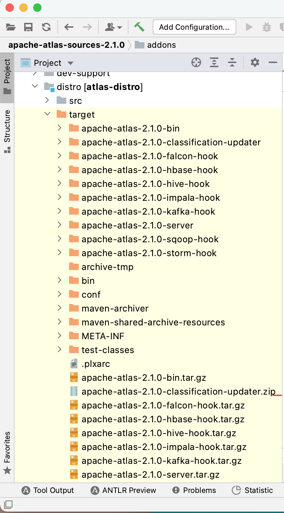

## 四、Atlas 安装 & 配置

开发环境中 Atlas 安装在 10.10.110.239 这台机器上(编译后的 tar 包在 root@10.10.110.239:/home/caiyi/atlas 下)

### 4.1 解压安装 atlas

将 apache-atlas-2.1.0-bin.tar.gz 解压至安装目录 /opt/atlas-2.1.0 (不要用官方文档说的server包, 那个包没有各种 hook 文件)

1. 创建 Atlas soft link 到 /usr/bin/atlas

   ```sh
   [root@fatcdh5 bin]# cd /usr/bin
   [root@fatcdh5 bin]# ln -s /opt/atlas-2.1.0 atlas
   ```

2. 配置 Atlas 在当前机器上的环境变量

   ```sh
   [root@fatcdh5 bin]# vi /etc/profile
   # 添加如下内容:
   #==========
   # Atlas
   #==========
   export ATLAS_HOME=/usr/bin/atlas
   export PATH=$PATH:$ATLAS_HOME/bin
   
   [root@fatcdh5 ~]# source /etc/profile
   [root@fatcdh5 ~]# echo $ATLAS_HOME
   /usr/bin/atlas
   ```

   > 这里记录一个小插曲: 
   >
   > 在配置 `export PATH=$PATH:$ATLAS_HOME/bin` 时手误写成了 `export PATH=$ATLAS_HOME/bin` , `source /etc/profile` 后发现 vi, sh,......, 好多命令都失效了, 就是因为这个 $PATH 的指向被错误的改变了.
   >
   > 解决方法: `export PATH=/usr/bin:/usr/sbin:/bin:/sbin:/usr/X11R6/bin` , 之后在使用 `vi /etc/profile` 修正 `export PATH=$PATH:$ATLAS_HOME/bin`

   

### 4.2 修改 atlas-env.sh 

修改 atlas-env.sh 文件(在最后添加如下内容):

```sh
#===================================================================
# Atlas Env (Modified at 2021-05-24 15:30 by caiyi@homedo.com)
#===================================================================
export HBASE_CONF_DIR=/etc/hbase/conf
export ATLAS_SERVER_HEAP="-Xms15360m -Xmx15360m -XX:MaxNewSize=5120m -XX:MetaspaceSize=100M -XX:MaxMetaspaceSize=512m"
export ATLAS_SERVER_OPTS="-server -XX:SoftRefLRUPolicyMSPerMB=0 -XX:+CMSClassUnloadingEnabled -XX:+UseConcMarkSweepGC -XX:+CMSParallelRemarkEnabled -XX:+PrintTenuringDistribution -XX:+HeapDumpOnOutOfMemoryError -XX:HeapDumpPath=dumps/atlas_server.hprof -Xloggc:logs/gc-worker.log -verbose:gc -XX:+UseGCLogFileRotation -XX:NumberOfGCLogFiles=10 -XX:GCLogFileSize=1m -XX:+PrintGCDetails -XX:+PrintHeapAtGC -XX:+PrintGCTimeStamps"
```

### 4.3 修改 atlas-application.properties

```properties
#
# Licensed to the Apache Software Foundation (ASF) under one
# or more contributor license agreements.  See the NOTICE file
# distributed with this work for additional information
# regarding copyright ownership.  The ASF licenses this file
# to you under the Apache License, Version 2.0 (the
# "License"); you may not use this file except in compliance
# with the License.  You may obtain a copy of the License at
#
#     http://www.apache.org/licenses/LICENSE-2.0
#
# Unless required by applicable law or agreed to in writing, software
# distributed under the License is distributed on an "AS IS" BASIS,
# WITHOUT WARRANTIES OR CONDITIONS OF ANY KIND, either express or implied.
# See the License for the specific language governing permissions and
# limitations under the License.
#

#########  Graph Database Configs  #########

# Graph Database

#Configures the graph database to use.  Defaults to JanusGraph
#atlas.graphdb.backend=org.apache.atlas.repository.graphdb.janus.AtlasJanusGraphDatabase

# Graph Storage
# Set atlas.graph.storage.backend to the correct value for your desired storage
# backend. Possible values:
#
# hbase
# cassandra
# embeddedcassandra - Should only be set by building Atlas with  -Pdist,embedded-cassandra-solr
# berkeleyje
#
# See the configuration documentation for more information about configuring the various  storage backends.
#
atlas.graph.storage.backend=hbase
atlas.graph.storage.hbase.table=apache_atlas_janus

#Hbase
#For standalone mode , specify localhost
#for distributed mode, specify zookeeper quorum here
atlas.graph.storage.hostname=10.10.110.235:2181,10.10.110.236:2181,10.10.110.238:2181
atlas.graph.storage.hbase.regions-per-server=1
atlas.graph.storage.lock.wait-time=10000

#In order to use Cassandra as a backend, comment out the hbase specific properties above, and uncomment the
#the following properties
#atlas.graph.storage.clustername=
#atlas.graph.storage.port=

# Gremlin Query Optimizer
#
# Enables rewriting gremlin queries to maximize performance. This flag is provided as
# a possible way to work around any defects that are found in the optimizer until they
# are resolved.
#atlas.query.gremlinOptimizerEnabled=true

# Delete handler
#
# This allows the default behavior of doing "soft" deletes to be changed.
#
# Allowed Values:
# org.apache.atlas.repository.store.graph.v1.SoftDeleteHandlerV1 - all deletes are "soft" deletes
# org.apache.atlas.repository.store.graph.v1.HardDeleteHandlerV1 - all deletes are "hard" deletes
#
#atlas.DeleteHandlerV1.impl=org.apache.atlas.repository.store.graph.v1.SoftDeleteHandlerV1

# Entity audit repository
#
# This allows the default behavior of logging entity changes to hbase to be changed.
#
# Allowed Values:
# org.apache.atlas.repository.audit.HBaseBasedAuditRepository - log entity changes to hbase
# org.apache.atlas.repository.audit.CassandraBasedAuditRepository - log entity changes to cassandra
# org.apache.atlas.repository.audit.NoopEntityAuditRepository - disable the audit repository
#
#atlas.EntityAuditRepository.impl=org.apache.atlas.repository.audit.HBaseBasedAuditRepository

# if Cassandra is used as a backend for audit from the above property, uncomment and set the following
# properties appropriately. If using the embedded cassandra profile, these properties can remain
# commented out.
# atlas.EntityAuditRepository.keyspace=atlas_audit
# atlas.EntityAuditRepository.replicationFactor=1

# Graph Search Index
atlas.graph.index.search.backend=solr

#Solr
#Solr cloud mode properties
atlas.graph.index.search.solr.mode=cloud
atlas.graph.index.search.solr.zookeeper-url=10.10.110.235:2181,10.10.110.236:2181,10.10.110.238:2181/solr
atlas.graph.index.search.solr.zookeeper-connect-timeout=60000
atlas.graph.index.search.solr.zookeeper-session-timeout=60000
atlas.graph.index.search.solr.wait-searcher=true

#Solr http mode properties
#atlas.graph.index.search.solr.mode=http
#atlas.graph.index.search.solr.http-urls=http://localhost:8983/solr

# ElasticSearch support (Tech Preview)
# Comment out above solr configuration, and uncomment the following two lines. Additionally, make sure the
# hostname field is set to a comma delimited set of elasticsearch master nodes, or an ELB that fronts the masters.
#
# Elasticsearch does not provide authentication out of the box, but does provide an option with the X-Pack product
# https://www.elastic.co/products/x-pack/security
#
# Alternatively, the JanusGraph documentation provides some tips on how to secure Elasticsearch without additional
# plugins: https://docs.janusgraph.org/latest/elasticsearch.html
#atlas.graph.index.search.hostname=localhost
#atlas.graph.index.search.elasticsearch.client-only=true

# Solr-specific configuration property
atlas.graph.index.search.max-result-set-size=150

#########  Import Configs  #########
#atlas.import.temp.directory=/temp/import

#########  Notification Configs  #########
atlas.notification.embedded=false
atlas.kafka.data=${sys:atlas.home}/data/kafka
atlas.kafka.zookeeper.connect=10.10.110.235:2181,10.10.110.236:2181,10.10.110.238:2181/kafka
atlas.kafka.bootstrap.servers=10.10.110.235:9092,10.10.110.236:9092,10.10.110.238:9092
atlas.kafka.zookeeper.session.timeout.ms=30000
atlas.kafka.zookeeper.connection.timeout.ms=30000
atlas.kafka.zookeeper.sync.time.ms=20
atlas.kafka.auto.commit.interval.ms=1000
atlas.kafka.hook.group.id=atlas

atlas.kafka.enable.auto.commit=false
atlas.kafka.auto.offset.reset=earliest
atlas.kafka.session.timeout.ms=30000
atlas.kafka.offsets.topic.replication.factor=1
atlas.kafka.poll.timeout.ms=1000

atlas.notification.create.topics=true
atlas.notification.replicas=1
atlas.notification.topics=ATLAS_HOOK,ATLAS_ENTITIES
atlas.notification.log.failed.messages=true
atlas.notification.consumer.retry.interval=500
atlas.notification.hook.retry.interval=1000
# Enable for Kerberized Kafka clusters
#atlas.notification.kafka.service.principal=kafka/_HOST@EXAMPLE.COM
#atlas.notification.kafka.keytab.location=/etc/security/keytabs/kafka.service.keytab

## Server port configuration
atlas.server.http.port=21000
#atlas.server.https.port=21443

########  Security Properties  #########

# SSL config
atlas.enableTLS=false

#truststore.file=/path/to/truststore.jks
#cert.stores.credential.provider.path=jceks://file/path/to/credentialstore.jceks

#following only required for 2-way SSL
#keystore.file=/path/to/keystore.jks

# Authentication config

atlas.authentication.method.kerberos=false
atlas.authentication.method.file=true

#### ldap.type= LDAP or AD
atlas.authentication.method.ldap.type=none

#### user credentials file
atlas.authentication.method.file.filename=${sys:atlas.home}/conf/users-credentials.properties

### groups from UGI
#atlas.authentication.method.ldap.ugi-groups=true

######## LDAP properties #########
#atlas.authentication.method.ldap.url=ldap://<ldap server url>:389
#atlas.authentication.method.ldap.userDNpattern=uid={0},ou=People,dc=example,dc=com
#atlas.authentication.method.ldap.groupSearchBase=dc=example,dc=com
#atlas.authentication.method.ldap.groupSearchFilter=(member=uid={0},ou=Users,dc=example,dc=com)
#atlas.authentication.method.ldap.groupRoleAttribute=cn
#atlas.authentication.method.ldap.base.dn=dc=example,dc=com
#atlas.authentication.method.ldap.bind.dn=cn=Manager,dc=example,dc=com
#atlas.authentication.method.ldap.bind.password=<password>
#atlas.authentication.method.ldap.referral=ignore
#atlas.authentication.method.ldap.user.searchfilter=(uid={0})
#atlas.authentication.method.ldap.default.role=<default role>


######### Active directory properties #######
#atlas.authentication.method.ldap.ad.domain=example.com
#atlas.authentication.method.ldap.ad.url=ldap://<AD server url>:389
#atlas.authentication.method.ldap.ad.base.dn=(sAMAccountName={0})
#atlas.authentication.method.ldap.ad.bind.dn=CN=team,CN=Users,DC=example,DC=com
#atlas.authentication.method.ldap.ad.bind.password=<password>
#atlas.authentication.method.ldap.ad.referral=ignore
#atlas.authentication.method.ldap.ad.user.searchfilter=(sAMAccountName={0})
#atlas.authentication.method.ldap.ad.default.role=<default role>

#########  JAAS Configuration ########

#atlas.jaas.KafkaClient.loginModuleName = com.sun.security.auth.module.Krb5LoginModule
#atlas.jaas.KafkaClient.loginModuleControlFlag = required
#atlas.jaas.KafkaClient.option.useKeyTab = true
#atlas.jaas.KafkaClient.option.storeKey = true
#atlas.jaas.KafkaClient.option.serviceName = kafka
#atlas.jaas.KafkaClient.option.keyTab = /etc/security/keytabs/atlas.service.keytab
#atlas.jaas.KafkaClient.option.principal = atlas/_HOST@EXAMPLE.COM

#########  Server Properties  #########
atlas.rest.address=http://localhost:21000
# If enabled and set to true, this will run setup steps when the server starts
atlas.server.run.setup.on.start=false

#########  Entity Audit Configs  #########
atlas.audit.hbase.tablename=apache_atlas_entity_audit
atlas.audit.zookeeper.session.timeout.ms=1000
atlas.audit.hbase.zookeeper.quorum=10.10.110.235:2181,10.10.110.236:2181,10.10.110.238:2181

#########  High Availability Configuration ########
atlas.server.ha.enabled=false
#### Enabled the configs below as per need if HA is enabled #####
#atlas.server.ids=id1
#atlas.server.address.id1=localhost:21000
#atlas.server.ha.zookeeper.connect=localhost:2181
#atlas.server.ha.zookeeper.retry.sleeptime.ms=1000
#atlas.server.ha.zookeeper.num.retries=3
#atlas.server.ha.zookeeper.session.timeout.ms=20000
## if ACLs need to be set on the created nodes, uncomment these lines and set the values ##
#atlas.server.ha.zookeeper.acl=<scheme>:<id>
#atlas.server.ha.zookeeper.auth=<scheme>:<authinfo>


######### Atlas Authorization #########
atlas.authorizer.impl=simple
atlas.authorizer.simple.authz.policy.file=atlas-simple-authz-policy.json

#########  Type Cache Implementation ########
# A type cache class which implements
# org.apache.atlas.typesystem.types.cache.TypeCache.
# The default implementation is org.apache.atlas.typesystem.types.cache.DefaultTypeCache which is a local in-memory type cache.
#atlas.TypeCache.impl=

#########  Performance Configs  #########
#atlas.graph.storage.lock.retries=10
#atlas.graph.storage.cache.db-cache-time=120000

#########  CSRF Configs  #########
atlas.rest-csrf.enabled=true
atlas.rest-csrf.browser-useragents-regex=^Mozilla.*,^Opera.*,^Chrome.*
atlas.rest-csrf.methods-to-ignore=GET,OPTIONS,HEAD,TRACE
atlas.rest-csrf.custom-header=X-XSRF-HEADER

############ KNOX Configs ################
#atlas.sso.knox.browser.useragent=Mozilla,Chrome,Opera
#atlas.sso.knox.enabled=true
#atlas.sso.knox.providerurl=https://<knox gateway ip>:8443/gateway/knoxsso/api/v1/websso
#atlas.sso.knox.publicKey=

############ Atlas Metric/Stats configs ################
# Format: atlas.metric.query.<key>.<name>
atlas.metric.query.cache.ttlInSecs=900
#atlas.metric.query.general.typeCount=
#atlas.metric.query.general.typeUnusedCount=
#atlas.metric.query.general.entityCount=
#atlas.metric.query.general.tagCount=
#atlas.metric.query.general.entityDeleted=
#
#atlas.metric.query.entity.typeEntities=
#atlas.metric.query.entity.entityTagged=
#
#atlas.metric.query.tags.entityTags=

#########  Compiled Query Cache Configuration  #########

# The size of the compiled query cache.  Older queries will be evicted from the cache
# when we reach the capacity.

#atlas.CompiledQueryCache.capacity=1000

# Allows notifications when items are evicted from the compiled query
# cache because it has become full.  A warning will be issued when
# the specified number of evictions have occurred.  If the eviction
# warning threshold <= 0, no eviction warnings will be issued.

#atlas.CompiledQueryCache.evictionWarningThrottle=0


#########  Full Text Search Configuration  #########

#Set to false to disable full text search.
#atlas.search.fulltext.enable=true

#########  Gremlin Search Configuration  #########

#Set to false to disable gremlin search.
atlas.search.gremlin.enable=false


########## Add http headers ###########

#atlas.headers.Access-Control-Allow-Origin=*
#atlas.headers.Access-Control-Allow-Methods=GET,OPTIONS,HEAD,PUT,POST
#atlas.headers.<headerName>=<headerValue>


#########  UI Configuration ########

atlas.ui.default.version=v1

atlas.hook.hive.synchronous=false
atlas.hook.hive.numRetries=3
atlas.hook.hive.queueSize=10000
atlas.cluster.name=primary
```


### 4.4 修改 atlas-log4j.xml文件

去掉以下代码的注释:

```xml
<appender name="perf_appender" class="org.apache.log4j.DailyRollingFileAppender">
  <param name="file" value="${atlas.log.dir}/atlas_perf.log" />
  <param name="datePattern" value="'.'yyyy-MM-dd" />
  <param name="append" value="true" />
  <layout class="org.apache.log4j.PatternLayout">
    <param name="ConversionPattern" value="%d|%t|%m%n" />
  </layout>
</appender>

<logger name="org.apache.atlas.perf" additivity="false">
  <level value="debug" />
  <appender-ref ref="perf_appender" />
</logger>
```

### 4.5 配置 HBase

添加集群的 `hbase` 配置文件到`${ATLAS_HOME}/conf/hbase`下(使用软连接)

```SH
[root@fatcdh5 ~]# cd /opt/atlas-2.1.0/conf
[root@fatcdh5 conf]# ln -s /etc/hbase/conf/ /opt/atlas-2.1.0/conf/hbase
[root@fatcdh5 conf]# cd hbase/ && ll
总用量 4
lrwxrwxrwx. 1 root root   16 5月  24 16:17 conf -> /etc/hbase/conf/
-rw-r--r--. 1 root root 1507 5月  10 22:04 hbase-site.xml.template
```


### 4.6 配置 Solr

1. 确认 Solr 的状态, 登录 http://10.10.110.238:8983/solr/#/~cloud?view=nodes 查看 nodes

   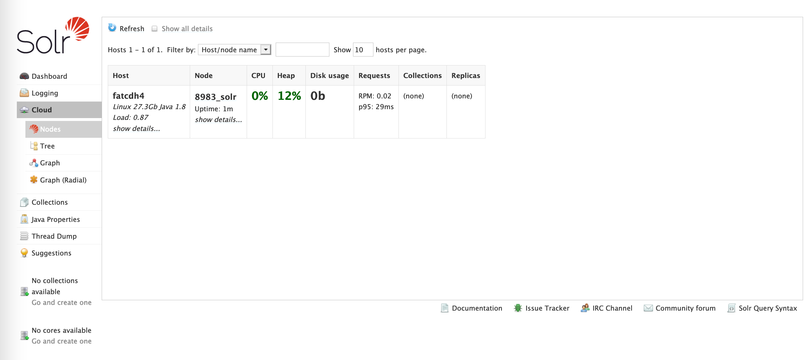

   

2. 将 `apache-atlas-2.1.0/conf/solr` 文件夹拷贝到 solr 所有的安装节点的目录下(开发 CDH 集群中就一台 Solr, home: root@10.10.110.238:/opt/cloudera/parcels/CDH/lib/solr)，更名为 `atlas-solr`

   ```sh
   [root@fatcdh5 atlas-2.1.0]# scp -r /opt/atlas-2.1.0/conf/solr root@10.10.110.238:/opt/cloudera/parcels/CDH/lib/solr
   ```

   切换环境到 Solr 安装节点(10.10.110.238)后, 执行以下命令:

   ```
   # 更改 ${sole_home}/solr 文件夹名称为 atlas_solr
   [root@fatcdh4 solr]# mv solr atlas-solr
   [root@fatcdh4 solr]# ll
   总用量 8
   drwxr-xr-x.  3 root root  140 5月  24 17:02 atlas-solr
   .....
   ```

3. 预创建 solr collection

   ```sh
   # 创建 solr 用户
   [root@fatcdh4 solr]# vi /etc/passwd
   修改 solr:x:993:990:Solr:/var/lib/solr:/sbin/nologin
   为 solr:x:993:990:Solr:/var/lib/solr:/bin/bash
   
   [root@fatcdh4 solr]# su - solr
   Last login: Mon May 24 17:17:47 CST 2021 on pts/0
   [solr@fatcdh4 ~]$ /opt/cloudera/parcels/CDH/lib/solr/bin/solr create -c  vertex_index -d /opt/cloudera/parcels/CDH/lib/solr/atlas-solr -shards 3 -replicationFactor 2
   
   [solr@fatcdh4 ~]$ /opt/cloudera/parcels/CDH/lib/solr/bin/solr create -c  edge_index -d /opt/cloudera/parcels/CDH/lib/solr/atlas-solr -shards 3 -replicationFactor 2
   
   [solr@fatcdh4 ~]$ /opt/cloudera/parcels/CDH/lib/solr/bin/solr create -c  fulltext_index -d /opt/cloudera/parcels/CDH/lib/solr/atlas-solr -shards 3 -replicationFactor 2
   ```

   验证 Collection 安装成功;

   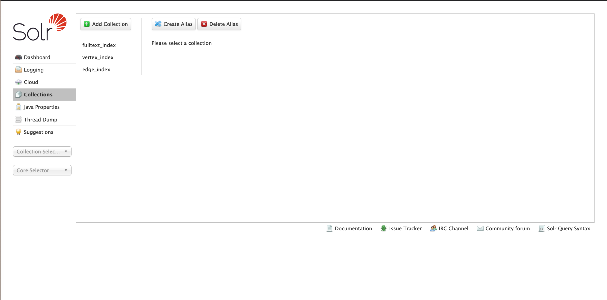

### 4.7 配置 Kafka

1. 创建 Kafka Topic

   ```sh
   [root@fatcdh4 solr]# kafka-topics --zookeeper 10.10.110.235:2181/kafka --create --replication-factor 3 --partitions 3 --topic _HOATLASOK
   [root@fatcdh4 solr]# kafka-topics --zookeeper 10.10.110.235:2181/kafka --create --replication-factor 3 --partitions 3 --topic ATLAS_ENTITIES
   [root@fatcdh4 solr]# kafka-topics --zookeeper 10.10.110.235:2181/kafka --create --replication-factor 3 --partitions 3 --topic ATLAS_HOOK
   ```

   

2. 查看 topic

   ```sh
   [root@fatcdh4 solr]# kafka-topics --list --zookeeper 10.10.110.235:2181,10.10.110.236:2181,10.10.110.238:2181/kafka
   ```

   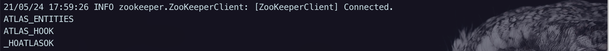


3. 尝试消费 topic 以确保 topic 正常

   ```sh
   [root@fatcdh2 conf]# kafka-console-consumer --bootstrap-server 10.10.110.235:9092 --topic _HOATLASOK
   [root@fatcdh2 conf]# kafka-console-consumer --bootstrap-server 10.10.110.235:9092 --topic ATLAS_ENTITIES
   [root@fatcdh2 conf]# kafka-console-consumer --bootstrap-server 10.10.110.235:9092 --topic ATLAS_HOOK
   ```

   

   

## 五、Atlas 启动测试

在 Atlas 安装节点上(10.10.110.239) 

1. 启动 Atlas

   ```sh
   [root@fatcdh5 ~]# atlas_start.py
   starting atlas on host localhost
   starting atlas on port 21000
   
   Apache Atlas Server started!!!
   
   [root@fatcdh5 ~]# curl -u admin:admin http://localhost:21000/api/atlas/admin/version
   {"Description":"Metadata Management and Data Governance Platform over Hadoop","Revision":"release","Version":"2.1.0","Name":"apache-atlas"}
   ```

   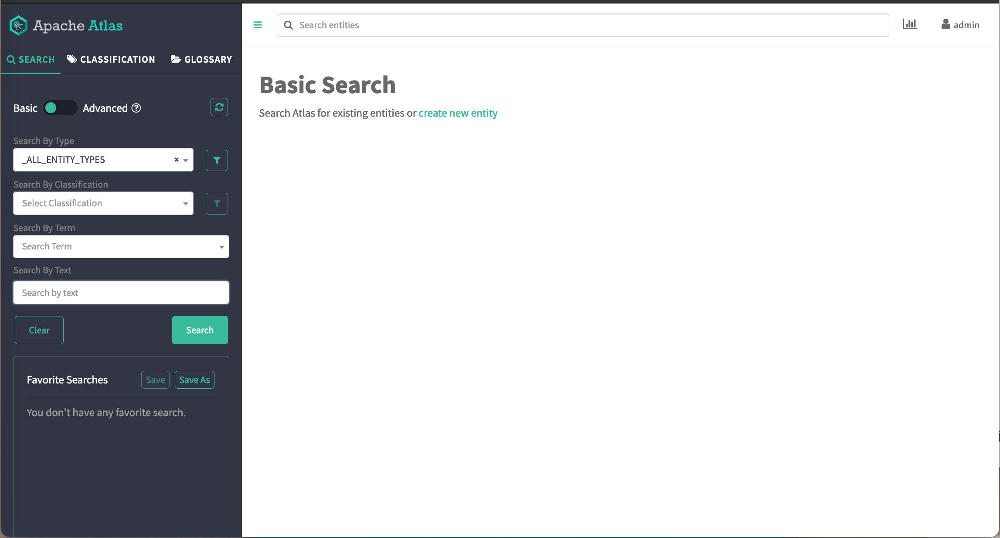

2. 停止 Atlas

   ```
   [root@fatcdh5 ~]# atlas_stop.py
   starting atlas on host localhost
   starting atlas on port 21000
   
   Apache Atlas Server started!!!
   ```


## 六、Atlas 集成 Hive

解决开发环境的历史遗留问题: 先删除上次安装 Atlas-1.1.0 时在开发的 CDH 集群所有节点的 ${HIVE_HOME}/lib 下的依赖; 生产环境不需要这一步

```sh
cd /opt/cloudera/parcels/CDH/lib/hive/lib && ll

cd /opt/cloudera/parcels/CDH/lib/hive/lib
rm -f scala-library-2.11.12.jar
rm -f kafka-clients-1.0.0.jar
rm -f kafka_2.11-1.0.0.jar
rm -f jsr311-api-1.1.jar
rm -f jersey-multipart-1.19.jar
rm -f jersey-json-1.19.jar
rm -f jackson-module-jaxb-annotations-2.9.6.jar
rm -f jackson-mapper-asl-1.9.2.jar
rm -f jackson-jaxrs-json-provider-2.9.6.jar
rm -f jackson-jaxrs-base-2.9.6.jar
rm -f jackson-dataformat-smile-2.5.4.jar
rm -f jackson-databind-2.9.6.jar
rm -f jackson-core-asl-1.9.2.jar
rm -f jackson-core-2.9.6.jar
rm -f jackson-annotations-2.9.6.jar
rm -f hive-bridge-shim-1.1.0.jar
rm -f hive-bridge-1.1.0.jar
rm -f hdfs-model-1.1.0.jar
rm -f hbase-server-1.1.2.jar
rm -f hbase-common-1.1.2.jar
rm -f commons-configuration-1.10.jar
rm -f atlas-plugin-classloader-1.1.0.jar
rm -f atlas-notification-1.1.0.jar
rm -f atlas-intg-1.1.0.jar
rm -f atlas-common-1.1.0.jar
rm -f atlas-client-v2-1.1.0.jar
rm -f atlas-client-v1-1.1.0.jar
rm -f atlas-client-common-1.1.0.jar
```

> Tips: 要先将 atlas-2.1.0 这个文件夹拷贝到提供 Hiveserver2 和 MetaStore 这些服务的机器上面的相同目录下(例如,统一都放在 /opt 目录下)

1. 将 `atlas-application.properties` 配置文件，压缩加入到 `atlas-plugin-classloader-2.0.0.jar` 中

   ```sh
   # 进入到 ${ATLAS_HOME}/conf 路径下, 必须在此路径打包，才能打到第一级目录下
   [root@fatcdh5 ~]# cd /opt/atlas-2.1.0/conf/
   [root@fatcdh5 conf]# zip -u /opt/atlas-2.1.0/hook/hive/atlas-plugin-classloader-2.1.0.jar atlas-application.properties
   ```

2. 修改 `hive-site.xml`

   - Hive 服务添加 HiveHook

     ```xml
     <property>
     	<name>hive.exec.post.hooks</name>
     	<value>com.homedo.iris.hive.hook.IrisHiveHook</value>
     </property>
     ```

     

     

   - Hive 客户端添加 HiveHook

     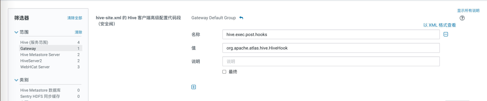

   

3. 修改 `hive-env.sh` 的 Gateway 客户端环境高级配置代码段（安全阀）

   添加如下内容(值视环境的具体配置更改):

   ```sh
   HADOOP_HOME=/opt/cloudera/parcels/CDH/lib/hadoop
   JAVA_HOME=/usr/java/jdk1.8.0_281
   ```

   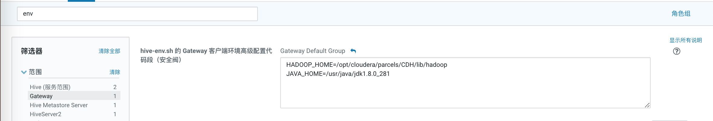

4. 修改 HiveServer2 高级配置代码段

   - 修改辅助 JAR 目录

     添加如下内容(值视环境的具体配置更改):

     ```sh
     /opt/iris/hook/hive
     ```

     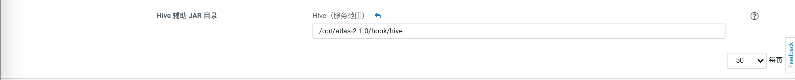

   - 修改 `hive-site.xml` 的 `HiveServer2` 高级配置代码段(安全阀)

     ```xml
     <property>
     	<name>hive.exec.post.hooks</name>
     	<value>com.homedo.iris.hive.hook.IrisHiveHook</value>
     </property>
     
     <property>
     	<name>hive.reloadable.aux.jars.path</name>
     	<value>/opt/iris/hook/hive</value>
     </property>
     ```

     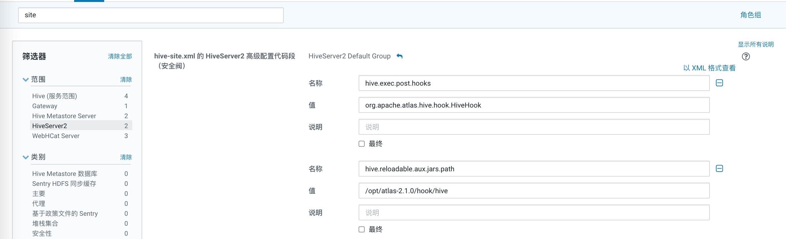

   - HiveServer2 环境高级配置代码段

     添加如下内容(值视环境的具体配置更改):

     ```sh
     HIVE_AUX_JARS_PATH=/opt/iris/hook/hive
     ```

     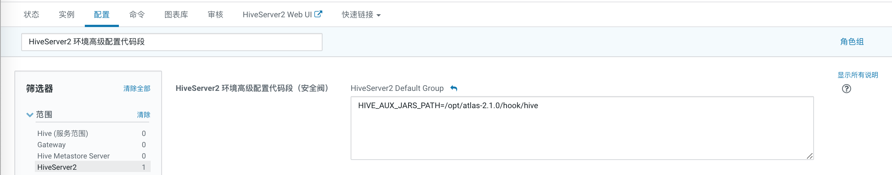

4. 将 Hive 元数据导入 Atlas

   默认账密是admin admin 

   ```sh
   [root@fatcdh5 atlas-2.1.0]# cd /opt/atlas-2.1.0
   [root@fatcdh5 atlas-2.1.0]# bin/import-hive.sh
   Using Hive configuration directory [/opt/cloudera/parcels/CDH/lib/hive/conf]
   /etc/hadoop/conf:/opt/cloudera/parcels/CDH-6.3.2-1.cdh6.3.2.p0.1605554/lib/hadoop/libexec/../../hadoop/lib/*:/opt/cloudera/parcels/CDH-6.3.2-1.cdh6.3.2.p0.1605554/lib/hadoop/libexec/../../hadoop/.//*:/opt/cloudera/parcels/CDH-6.3.2-1.cdh6.3.2.p0.1605554/lib/hadoop/libexec/../../hadoop-hdfs/./:/opt/cloudera/parcels/CDH-6.3.2-1.cdh6.3.2.p0.1605554/lib/hadoop/libexec/../../hadoop-hdfs/lib/*:/opt/cloudera/parcels/CDH-6.3.2-1.cdh6.3.2.p0.1605554/lib/hadoop/libexec/../../hadoop-hdfs/.//*:/opt/cloudera/parcels/CDH/lib/hadoop-mapreduce/.//*:/opt/cloudera/parcels/CDH-6.3.2-1.cdh6.3.2.p0.1605554/lib/hadoop/libexec/../../hadoop-yarn/lib/*:/opt/cloudera/parcels/CDH-6.3.2-1.cdh6.3.2.p0.1605554/lib/hadoop/libexec/../../hadoop-yarn/.//*:/opt/cloudera/parcels/GPLEXTRAS-6.3.2-1.gplextras6.3.2.p0.1605554/lib/hadoop/lib/COPYING.hadoop-lzo:/opt/cloudera/parcels/GPLEXTRAS-6.3.2-1.gplextras6.3.2.p0.1605554/lib/hadoop/lib/hadoop-lzo-0.4.15-cdh6.3.2.jar:/opt/cloudera/parcels/GPLEXTRAS-6.3.2-1.gplextras6.3.2.p0.1605554/lib/hadoop/lib/hadoop-lzo.jar:/opt/cloudera/parcels/GPLEXTRAS-6.3.2-1.gplextras6.3.2.p0.1605554/lib/hadoop/lib/native
   Log file for import is /opt/atlas-2.1.0/logs/import-hive.log
   SLF4J: Class path contains multiple SLF4J bindings.
   SLF4J: Found binding in [jar:file:/opt/cloudera/parcels/CDH-6.3.2-1.cdh6.3.2.p0.1605554/jars/log4j-slf4j-impl-2.8.2.jar!/org/slf4j/impl/StaticLoggerBinder.class]
   SLF4J: Found binding in [jar:file:/opt/cloudera/parcels/CDH-6.3.2-1.cdh6.3.2.p0.1605554/jars/slf4j-log4j12-1.7.25.jar!/org/slf4j/impl/StaticLoggerBinder.class]
   SLF4J: See http://www.slf4j.org/codes.html#multiple_bindings for an explanation.
   SLF4J: Actual binding is of type [org.apache.logging.slf4j.Log4jLoggerFactory]
   ERROR StatusLogger No log4j2 configuration file found. Using default configuration: logging only errors to the console. Set system property 'org.apache.logging.log4j.simplelog.StatusLogger.level' to TRACE to show Log4j2 internal initialization logging.
   Enter username for atlas :- admin
   Enter password for atlas :-
   Hive Meta Data imported successfully!!!
   ```
   

## 七、Atlas web UI 测试

导入 Hive 元数据成功后, 打开 web 页面(admin/admin)http://10.10.110.239:21000

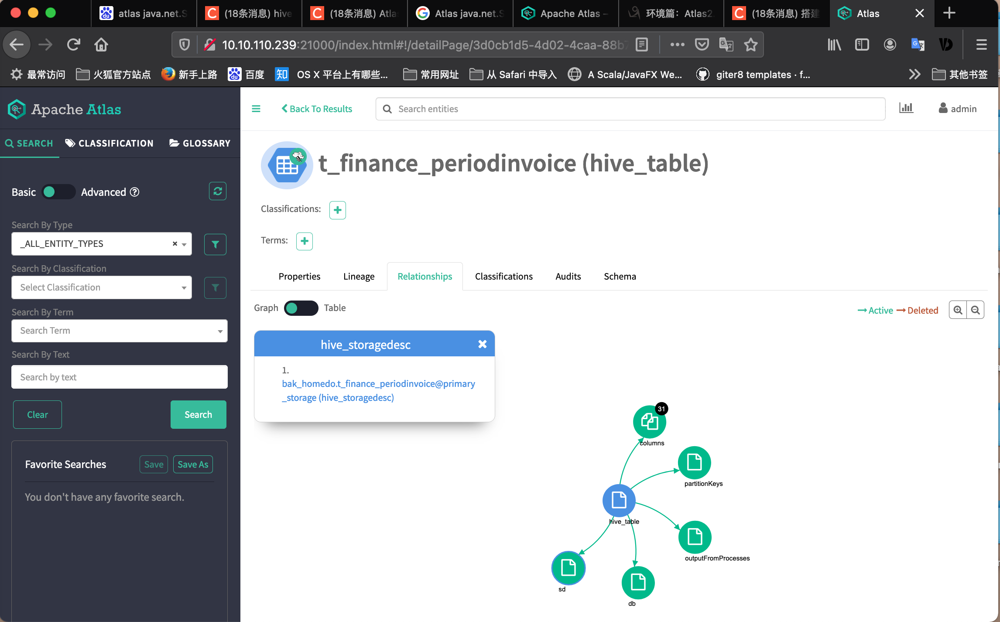

## 八、躺过的坑

1. 配置文件 atlas-application.properties 中的 `atlas.graph.storage.hostname` 和 `atlas.audit.hbase.zookeeper.quorum` 这两个配置不需要精准定位到 HBase 在 zookeeper 的 URL, 只需要配置 zookeeper quorum, 例如, 我们 HBase 在 ZK 上的存储路径为 cdh1:2181, cdh2:2181,cdh3:2181/hbase, 这里的配置只需要精确到 cdh1:2181,cdh2:2181,cdh3:2181

2. 配置文件 atlas-application.properties 中的 `atlas.kafka.zookeeper.connect` 源码中该配置是用来实例化一个 ZkClient 实例的, 所以该参数值, 需要精确到 Kafka 在 ZK 上的 URL 地址, 例如, `10.10.110.235:2181,10.10.110.236:2181,10.10.110.238:2181/kafka`

3. Failed to load application properties

   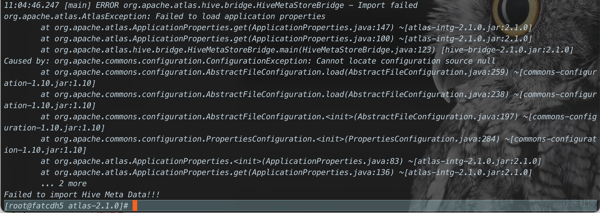

   解决: 在 atlas 安装节点上将 `atlas-application.properties` 拷贝到当前节点的 `${HIVE_HOME}/conf` 下

   ```sh
   cd /opt/cloudera/parcels/CDH/lib/hive/conf
   ln -s /opt/atlas-2.1.0/conf/atlas-application.properties atlas-application.propertiesVersion information not found in metastore.
   ```

4. 如果在导入元数据的过程中一直报 HiveMetastoreInitialization Failed, 这种错误, 记得一定要将 Hive 节点上的 hive-site.xml 拷贝一份到当前 atlas 所在节点的 $HIVE_HOME/conf 目录下

