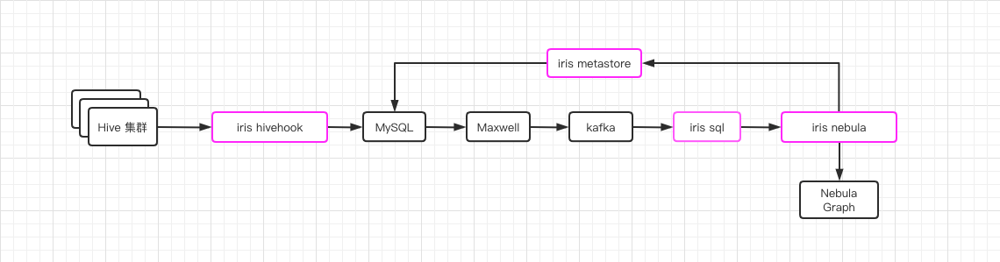

# Iris 一期开发记录

这是在 6 月份中旬确定的 iris 一期血缘元数据功能的架构图: 



但随着在开发过程中不断地踩坑, 调研和优化, 在 6 月底正式确认 iris 一期血缘元数据功能的架构图:


Iris 6 月份开发周期时序图:


## 开发记录

1. 上周线上 BUG 排查

```shell
27-06-2021 06:34:40 CST fact_handleraccountid_purchase_detail INFO - Exception in thread "main" java.util.ServiceConfigurationError: com.homedo.iris.hive.hook.adaptor.HiveOperationAdaptor: Provider com.homedo.iris.hive.hook.adaptor.QueryOperationAdaptor could not be instantiated
27-06-2021 06:34:40 CST fact_handleraccountid_purchase_detail INFO -   at java.util.ServiceLoader.fail(ServiceLoader.java:232)
27-06-2021 06:34:40 CST fact_handleraccountid_purchase_detail INFO -   at java.util.ServiceLoader.access$100(ServiceLoader.java:185)
Caused by: java.lang.ExceptionInInitializerError
27-06-2021 06:12:46 CST fact_vip_card_list INFO -   at sun.reflect.NativeConstructorAccessorImpl.newInstance0(Native Method)
27-06-2021 06:12:46 CST fact_vip_card_list INFO -   at sun.reflect.NativeConstructorAccessorImpl.newInstance(NativeConstructorAccessorImpl.java:62)
27-06-2021 06:12:46 CST fact_vip_card_list INFO -   at sun.reflect.DelegatingConstructorAccessorImpl.newInstance(DelegatingConstructorAccessorImpl.java:45)
27-06-2021 06:12:46 CST fact_vip_card_list INFO -   at java.lang.reflect.Constructor.newInstance(Constructor.java:423)
27-06-2021 06:12:46 CST fact_vip_card_list INFO -   at java.lang.Class.newInstance(Class.java:442)
27-06-2021 06:12:46 CST fact_vip_card_list INFO -   at java.util.ServiceLoader$LazyIterator.nextService(ServiceLoader.java:380)
27-06-2021 06:12:46 CST fact_vip_card_list INFO -   ... 28 more
27-06-2021 06:12:46 CST fact_vip_card_list INFO - Caused by: org.rocksdb.RocksDBException: While lock file: /tmp/rocksdb/iris/LOCK: Resource temporarily unavailable
```

>根据报错, 明显是Hive 的多线程导致 RocksDB 客户端的 LOCK 锁存在竞争导致 QueryOperationAdaptor 初始化失败而引起的一些异常
>
>因为 RocksDB 的官方客户端 API 是线程安全的, 如果存在资源竞争, 即多线程同时读写 Rocksdb 库, 那么 RocksDB 会使用 LOCK 来确保竞争之间的线程安全。因为 hive 晚上跑批瞬时并发量很高, 所以就存在了多线程同时竞争 LOCK 锁, 部分先出获取 LOCK 失败导致 RocksDB 客户端的初始化失败进而导致了 QueryOperationAdaptor 的初始化失败, 从而引起了一些列报错问题

> 解决方案: 
>
> 之前使用 RocksDB 主要考虑其内嵌的特性,  但当时并未注意到 Hive 执行 SQL 时采用了线程池有较高的并发量, 并发会引起 RocksDB 之间 LOCK 的资源竞争, 并且因为开发环境测试多为单个线程的 SQL 测试, 也未曾暴露出该问题。
>
> 使用 Redis 替换缓存层存储, 因为 Redis 有官方支持的 JedisPool 池化连接技术, 每秒可以从容应对上万的并发访问
> 并且为了保证缓存和数据库的双写一致性, 使用类似 Mysql 行锁的技术来锁定每个 primary key(sid), 这样会最大程度减少不同 sid 之间的竞争, 并且可以保证每个 sid 的数据库和缓存更新一致性

2. 由于生产和开发环境不一致, IrisHiveHook 在开发环境无法抓取到全量的 SQL, 所以需要将 IrisHiveHook 部署到生产环境, 但因为程序的不稳定性, 所以只能于每周六部署到生产,  这样大大增加了实际测试的时长。