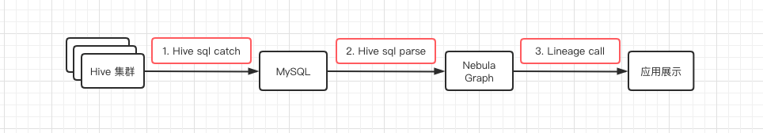
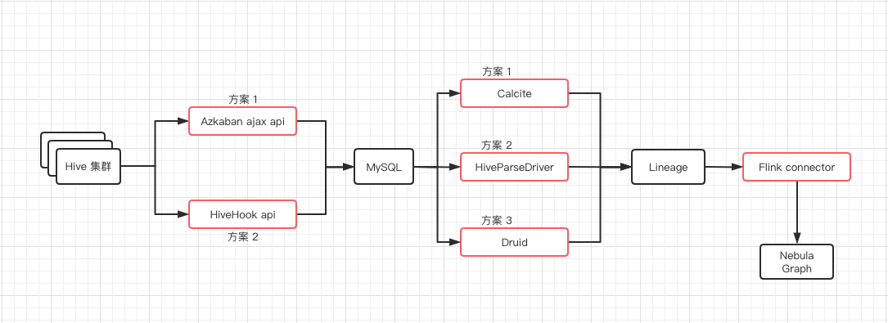
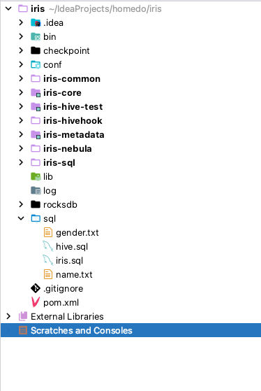
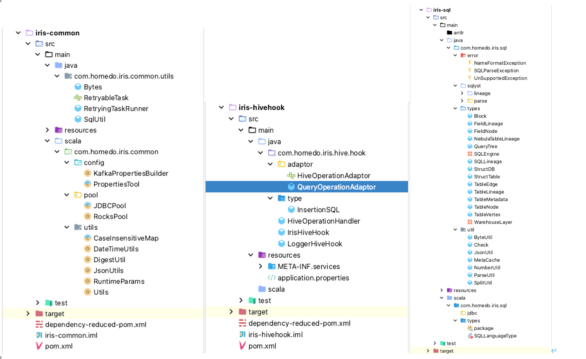

# Iris 平台调研

Iris 元数据管理平台


## 一、架构调研

在前期调研各个技术点之前的整体技术方案是:



这架构主要涉及到 3 个技术点:

1. 如何抓取 Hive 上每晚跑批的 hive sql?
2. 抓取到 hive sql 如何将其解析成 AST, 并从中获取血缘表及字段?
3. 表以及血缘字段关系如何存储? 以及后期如何对外提供服务?

针对以上的大问题, 我们前期调研了各类技术方案:



### 1.1 抓取 Hive SQL

#### 1.1.1 Azkaban metadata

因为生产中使用了 Azkaban 来进行 Hive SQL 的调度, 所以最初的想法就是使用 Azkaban 的 Ajax API 来依次从 projectid 调用 flowid 到 jobid。

但在测试中该方案有如下问题:

1. 当 project 量很大时, 对应的多个 flow 和 job 量也很大, 递归解析效率很低
2. Azkaban 平台上调度的有非 Hive sql 的 project, 这部分逻辑需要整合架构方面做统一
3. 当 Hive sql 某表逻辑变化时, Azkaban 中无法直接感知到该 Hive sql 的逻辑变化
4. 要解决上述所有问题, 开发量极其的大

#### 1.1.2 HiveHook

##### 1.1.2.1 基于 MR 的 Hive 架构


- driver

  接收查询的组件。 该组件实现了会话句柄的概念，并提供了在JDBC / ODBC接口上的执行和获取数据的api模型。

- compile

  解析查询的组件，对不同的查询块和查询表达式进行语义分析，最终通过从metastore获取表和分区的信息生成执行计划。

- Metastore

  存储仓库中各种表和分区的所有结构信息的组件，包括列和列类型信息，读取和写入数据所需的序列化程序和反序列化程序以及存储数据的相应HDFS文件。

- execution engine

  执行编译器创建的执行计划的组件。 该计划是一个stages的DAG。 执行引擎管理计划的这些不同阶段之间的依赖关系，并在适当的系统组件上执行这些阶段。

##### 1.1.2.2 hive 查询的生命周期

hive查询在hive中的执行过程。

1. Driver接受命令。
2. org.apache.hadoop.hive.ql.HiveDriverRunHook.preDriverRun() 读取 hive.exec.pre.hooks 决定要运行的 pre-hooks 。
3. org.apache.hadoop.hive.ql.Driver.compile() 通过创建代表该查询的抽象语法树(AST)来开始处理查询。
4. org.apache.hadoop.hive.ql.parse.AbstractSemanticAnalyzerHook 实现了 HiveSemanticAnalyzerHook，调用 `preAnalyze()` 方法。
5. 对抽象语法树（AST）执行语义分析。
6. org.apache.hadoop.hive.ql.parse.AbstractSemanticAnalyzerHook.postAnalyze() 会被调用，它执行所有配置的语义分析 hooks。
7. 创建并验证物理查询计划。
8. `Driver.execute()` 已经准备好开始运行job
9. `调用 org.apache.hadoop.hive.ql.hooks.ExecuteWithHookContext.run()` 方法去执行所有的 pre-execution hooks。
10. org.apache.hadoop.hive.ql.hooks.ExecDriver.execute()执行该query的所有jobs
11. 对于每个 job 都会执行 org.apache.hadoop.hive.ql.stats.ClientStatsPublisher.run()，来为每个job发布统计信息。该间隔是由 hive.exec.counters.pull.interval 配置控制，默认是1000ms。hive.client.stats.publishers 配置决定着运行的 publishers。也可以通过设置 hive.client.stats.counters 来决定发布哪些 counters。
12. 完成所有 task。
13. （可选）如果任务失败，请调用hive.exec.failure.hooks配置的hooks。
14. 通过对所有 hive.exec.post.hooks 指定的 hooks 执行 ExecuteWithHookContext.run() 来运行 post execution hooks。
15. org.apache.hadoop.hive.ql.HiveDriverRunHook.postDriverRun（）。请注意，这是在查询完成运行之后以及将结果返回给客户端之前运行的。
16. 返回结果。

##### 1.1.2.3 Hive Hook API

Hive 支持许多不同类型的 Hook。 Hook 接口是 Hive 中所有 Hook 的父接口。它是一个空接口，并通过以下特定 hook 的接口进行了扩展：

1. PreExecute 和 PostExecute 将 Hook 接口扩展到 Pre 和 Post 执行 hook。

2. ExecuteWithHookContext 扩展 Hook 接口以将 HookContext 传递给 hook。HookContext 包含了 hook 可以使用的所有信息。 HookContext 被传递给名称中包含“WithContext”的所有钩子。

3. HiveDriverRunHook 扩展了 Hook 接口，在 driver 阶段运行，允许在 Hive 中自定义逻辑处理命令。

4. HiveSemanticAnalyzerHook 扩展了 Hook 接口，允许插入自定义逻辑以进行查询的语义分析。它具有preAnalyze（）和postAnalyze（）方法，这些方法在Hive执行自己的语义分析之前和之后执行。

5. HiveSessionHook扩展了Hook接口以提供会话级hook。在启动新会话时调用hook。用hive.server2.session.hook配置它。

6. Hive 1.1添加了Query Redactor  Hooks。它是一个抽象类，它实现了Hook接口，可以在将查询放入job.xml之前删除有关查询的敏感信息。可以通过设置hive.exec.query.redactor.hooks属性来配置此hook。

##### 1.1.2.4 测试 PostExecute 

```java
package com.homedo.iris.hive.hook;

import com.fasterxml.jackson.databind.ObjectMapper;
import lombok.NonNull;
import org.apache.hadoop.hive.ql.QueryPlan;
import org.apache.hadoop.hive.ql.hooks.Entity;
import org.apache.hadoop.hive.ql.hooks.ExecuteWithHookContext;
import org.apache.hadoop.hive.ql.hooks.HookContext;
import org.apache.hadoop.hive.ql.hooks.ReadEntity;
import org.apache.hadoop.hive.ql.hooks.WriteEntity;
import org.apache.hadoop.hive.ql.plan.HiveOperation;
import org.slf4j.Logger;
import org.slf4j.LoggerFactory;

import java.util.HashSet;
import java.util.Set;

public class LoggerHiveHook implements ExecuteWithHookContext {

	private static final Logger log = LoggerFactory.getLogger(IrisHiveHook.class);
	private static final Set<String> OPERATION_NAMES = new HashSet<>();

	static {
		// 建表
		OPERATION_NAMES.add(HiveOperation.CREATETABLE.getOperationName());
		// 修改数据库属性
		OPERATION_NAMES.add(HiveOperation.ALTERDATABASE.getOperationName());
		// 修改数据库属主
		OPERATION_NAMES.add(HiveOperation.ALTERDATABASE_OWNER.getOperationName());
		// 修改表属性,添加列
		OPERATION_NAMES.add(HiveOperation.ALTERTABLE_ADDCOLS.getOperationName());
		// 修改表属性,表存储路径
		OPERATION_NAMES.add(HiveOperation.ALTERTABLE_LOCATION.getOperationName());
		// 修改表属性
		OPERATION_NAMES.add(HiveOperation.ALTERTABLE_PROPERTIES.getOperationName());
		// 表重命名
		OPERATION_NAMES.add(HiveOperation.ALTERTABLE_RENAME.getOperationName());
		// 列重命名
		OPERATION_NAMES.add(HiveOperation.ALTERTABLE_RENAMECOL.getOperationName());
		// 更新列,先删除当前的列,然后加入新的列
		OPERATION_NAMES.add(HiveOperation.ALTERTABLE_REPLACECOLS.getOperationName());
		// 创建数据库
		OPERATION_NAMES.add(HiveOperation.CREATEDATABASE.getOperationName());
		// 删除数据库
		OPERATION_NAMES.add(HiveOperation.DROPDATABASE.getOperationName());
		// 删除表
		OPERATION_NAMES.add(HiveOperation.DROPTABLE.getOperationName());
		// HiveOperation.QUERY type encompasses
		//      INSERT, INSERT_OVERWRITE,
		//      UPDATE, DELETE, PATH_WRITE
		OPERATION_NAMES.add(HiveOperation.QUERY.getOperationName());
	}

	@Override
	public void run (HookContext hookContext) throws Exception {

		assert (hookContext.getHookType() == HookContext.HookType.POST_EXEC_HOOK);
		QueryPlan queryPlan = hookContext.getQueryPlan();
		if (!queryPlan.isExplain()) {
			// =======================================================
			logWithHeader("=====> SQL: " + queryPlan.getQueryString());
			logWithHeader("=====> OPERATION: " + queryPlan.getOperationName());
			logWithHeader("=====> 监控 SQL 操作");
			Set<ReadEntity> inputs = hookContext.getInputs();
			Set<WriteEntity> outputs = hookContext.getOutputs();
			logWithHeader("\t =====> Inputs size: " + inputs.size());
			logWithHeader("\t =====> Outputs size: " + outputs.size());

			for (ReadEntity input : inputs) {
				logWithHeader("\t =====> ReadEntity type: " + input.getType());
				logWithHeader("\t =====> Hook metadata 输入值: " + toJson(input));
			}
			for (WriteEntity output : outputs) {
				logWithHeader("\t =====> WriteEntity type: " + output.getType());
				logWithHeader("\t =====> Hook metadata输出值: " + toJson(output));
			}
			// =======================================================
		}
		else {
			logWithHeader("不在监控范围，忽略该 hook!");
		}
	}

	private static String toJson(@NonNull Entity entity) throws Exception {
		ObjectMapper mapper = new ObjectMapper();
		//  Entity encompasses:
		//      DATABASE,
		//      TABLE,
		//      PARTITION,
		//      DUMMYPARTITION,
		//      DFS_DIR,
		//      LOCAL_DIR,
		//      FUNCTION
		switch (entity.getType()) {
			case DATABASE:
				return mapper.writeValueAsString(entity.getDatabase());
			case TABLE:
				return mapper.writeValueAsString(entity.getTable().getTTable());
			default:
				return null;
		}
	}

	/**
	 * 日志格式
	 */
	private void logWithHeader(Object obj) {
		log.info("==> [Custom Post HiveHook][Thread: " + Thread.currentThread().getName() + "] | " + obj);
	}
}
```

配置 HiveHook

```sh
# 在 beeline 客户端中添加如下配置
add jar /Users/sherlock/IdeaProjects/homedo/iris/jar/iris-hivehook-log.jar;
add jar /Users/sherlock/IdeaProjects/homedo/iris/iris-hivehook/target/iris-hivehook-1.0-SNAPSHOT.jar;
set hive.exec.post.hooks=com.homedo.iris.hive.hook.HiveHook;
```

创建测试用表及测试数据

```sql
create table dwd_name(
    id int,
    name string
)
row format delimited
fields terminated by ','
;

create table dwd_gender(
    id int,
    gender string
)
row format delimited
fields terminated by ','
;

create table dws_info(
    id int,
    name string,
    gender string
)
row format delimited
fields terminated by ','
;

-- local
LOAD DATA LOCAL INPATH '/Users/sherlock/IdeaProjects/homedo/iris/sql/name.txt' INTO TABLE dwd_name;
LOAD DATA LOCAL INPATH '/Users/sherlock/IdeaProjects/homedo/iris/sql/gender.txt' INTO TABLE dwd_gender;

INSERT INTO dws_info -- cmt1
SELECT n.id, n.name, g.gender           --           cm2
FROM dwd_name n -- cmt 5
LEFT JOIN dwd_gender g
ON n.id = g.id;
```

查看 hive 日志 hive.log


HiveHook 的优点:

1. 可以对不同生命周期下的 SQL 依据业务逻辑做各种处理
2. 绑定到了 Hive 内部的工作机制，无需重新编译 Hive


### 1.2 Hive sql parser

该模块是整个 Irsi 平台的核心模块, 因为该模块承载了所有 SQL 的解析工作, 以及表和列血缘解析工作

现市面上比较成熟的 SQL 解析工具有 Calcite(Flink, Spark等都使用该工具进行解析 SQL), Antlr(Hive, Druid 等使用了该工具进行 SQL 解析)

因为前期调研时间太短, 而 Calcite 将 SQL 解析为 AST(抽象语法树) 后, 后续的 TreeNode 判断需要自己来实现该逻辑, 开发较为困难(开发时间不足). 

在查看 Hive 源码 QueryPlan 中发现有 getInputs/getOutputs 获取输入输出表逻辑, 于是从这部分代码入手, 二次开发 Hive 源码将其血缘解析功能移植出来。

整个解析逻辑如下:

>目的：实现 HQL 的语句解析，分析出输入输出表、字段和相应的处理条件。为字段级别的数据血缘提供基础。
>重点：获取 SELECT 操作中的表和列的相关操作。其他操作这判断到字段级别。
>实现思路：对 AST 深度优先遍历，遇到操作的token则判断当前的操作，遇到子句则压栈当前处理，处理子句。子句处理完，栈弹出。
>
>1. 处理字句的过程中，遇到子查询就保存当前子查询的信息，判断与其父查询的关系，最终形成树形结构；
>2. 遇到字段或者条件处理则记录当前的字段和条件信息、组成 Block，嵌套调用。
>3. 关键点解析
>     3.1 遇到 TOK_TAB 或 TOK_TABREF 则判断出当前操作的表
>     3.2 压栈判断是否是join，判断join条件
>     3.3 定义数据结构Block,遇到在 where\select\join 时获得其下相应的字段和条件，组成 Block
>     3.4 定义数据结构 FieldLineage,遇到TOK_SUBQUERY保存当前的子查询信息，供父查询使用 
>     3.5 定义数据结构 FieldLineage,遇到TOK_UNION结束时，合并并截断当前的列信息
>     3.6 遇到 select * 或者未明确指出的字段，查询元数据进行辅助分析
>     3.7 解析结果进行相关校验
>     试用范围：
>     1、支持标准SQL 
>     2、不支持 transform using script


## 二、一期开发(进行中)


目前开发过程中出现的问题:

1. 每晚跑批的 SQL 如果没有发生变化, 但是 HiveHook 都会钩取到该 SQL 并 insert/update 到数据库, 会有很多无用的写操作? (以解决)

   对于 SQL 的变化我们通过 md5 值来判断, 如果 md5 值发生变化, 则该条 SQL 更新, 则会 update Mysql 数据库。

   对于无效写操作, 在外曾使用 RocksDB 来缓存 tid(每条有效 SQL 都会有一个目标表), 每次写数据库前, 先从缓存中获取 SQL md5, 如果 md5 存在且未变化则, 不写数据库, 否则刷写数据库更新 sql

   

2. 某张表的 sql 逻辑发生变化, 外部如何感知该变化? (以解决)

   对于某张表的 sql 发生变化. 因为 SQL 元数据库暂时只有 insert/update 两种操作, 即数据库发生了 upsert 操作, 可以在外部使用 maxwell 监听数据库的 binlog, 当监听到以上变化后, 将更新后 sql 解析并刷写到下游图数据库即可(因为 tid 一致所以可以保证一致性)

3. 统一数据模型的建设? (以解决)

   因为上下游涉及到不同的 SQL 存储端(Hive, Doris), 所以需要对输入的数据格式做统一模型处理, 例如统一表模型, 统一数据库模型.....

   ```scala
   package com.homedo.iris.sql.types;
   
   import com.homedo.iris.sql.error.NameFormatException;
   import com.homedo.iris.sql.error.UnSupportedException;
   import lombok.Getter;
   import lombok.Setter;
   import lombok.ToString;
   import lombok.extern.slf4j.Slf4j;
   import org.apache.spark.sql.types.StructType;
   
   import java.util.Locale;
   
   /**
    * <p>表的统一模型</p>
    * todo 要考虑设计统一接口来获取表的 schema 和 metadata
    */
   @ToString
   @Slf4j
   public class StructTable {
   
   	private static final String TABLE_NAME_SEPERATOR = "_";
   
   	@Getter
   	private final int tid;
   	@Getter
   	private final StructDB db;
   	@Getter
   	private final WarehouseLayer layer;
   	@Setter @Getter
   	private String name;
   	@Setter @Getter
   	private StructType schema;
   	@Setter @Getter
   	private TableMetadata metadata;
   	@Setter @Getter
   	private String alias;
   
   	public StructTable(StructDB db, String name) {
   		this.db = db;
   		this.name = name;
   		this.tid = hashCode();
   		this.layer = hierarchy(name);
   	}
   
   	private WarehouseLayer hierarchy(String name) {
   		if (!name.contains(TABLE_NAME_SEPERATOR)) {
   			throw new NameFormatException("=====> Incorrect table name format: " + name + ", Table names should be named using '_';");
   		}
   		WarehouseLayer whLayer = null;
   		String layerName = name.split(TABLE_NAME_SEPERATOR, 2)[0];
   		log.info("=====> get layer name:[" + layerName + "] from table :[" + name +"];");
   		try {
   			String standardLayerName = WarehouseLayer.standardLayerName(layerName);
   			log.info("=====> standard orign layer name:[" + layerName + "] to standard name:[" + standardLayerName +"];");
   			whLayer = WarehouseLayer.valueOf(standardLayerName.toUpperCase(Locale.ROOT));
   		} catch (IllegalArgumentException | UnSupportedException ignored) {
   			String formatLayerNames = WarehouseLayer.formatLayerNames();
   			throw new UnSupportedException("=====> Unsupport warehouse layer: " + layerName + ", only support layers : " + formatLayerNames + " for now;" );
   		}
   		return whLayer;
   	}
   
   	@Override
   	public int hashCode () {
   		final int prime = 31;
   		int result = 1;
   		result = prime * result + ((db == null) ? 0 : db.hashCode());
   		result = prime * result + ((name == null) ? 0 : name.hashCode());
   		return result;
   	}
   
   	public String getCsvFormat() {
   		return this.getTid() + "," + this.getName() + "," + this.getDb().getName() + "," + this.getDb().getType().getName();
   	}
   }
   ```

4. maxwell 的监控及单点故障问题 (暂未解决)

   轮询监控 maxwell health

   单点故障问题, 解决该问题需要修改 Maxwell 源码添加 zk 服务来解决单点问题


## 三、项目代码架构





项目目前分为 5 个模块

1. iris-common common 模块, 主要包括一些工具类, 存储端连接池等

2. iris-hivehook hivehook 模块, 用来抓取 hive sql 并存入 MySql

3. iris-metadata metadata 表 scheme 的抓取服务

4. iris-nebula nebula模块 数据刷写到 Nebula Graph(开发中)
5. iris-sql sql 解析模块, 解析 sql 并提供的表和字段的血缘关系

