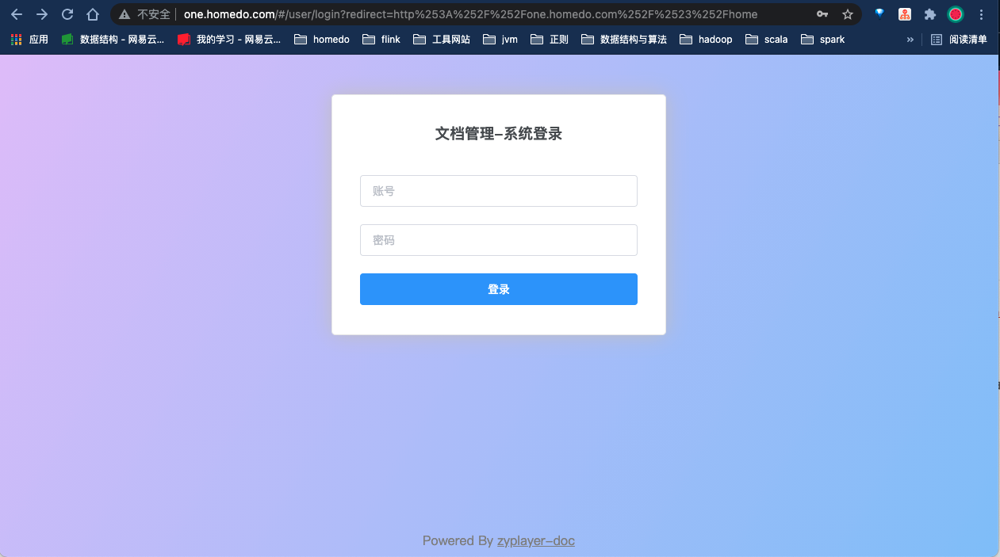
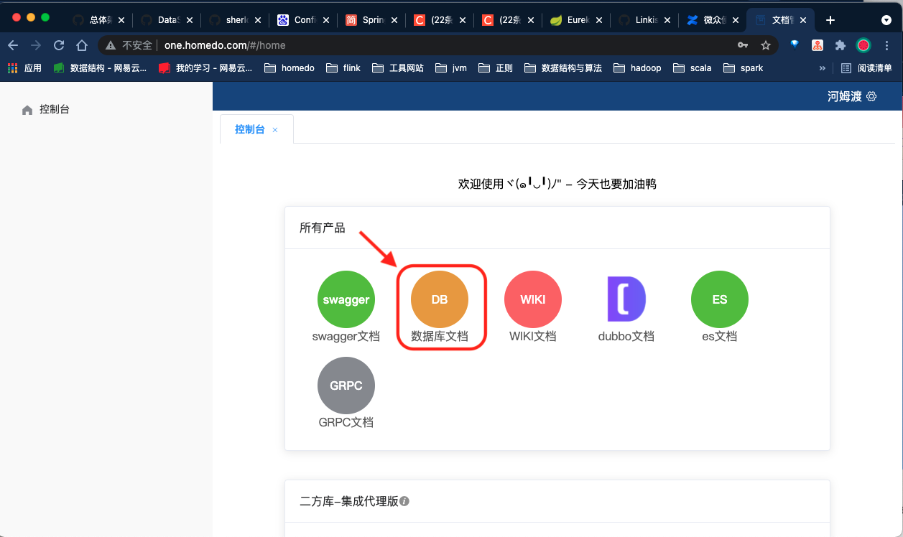
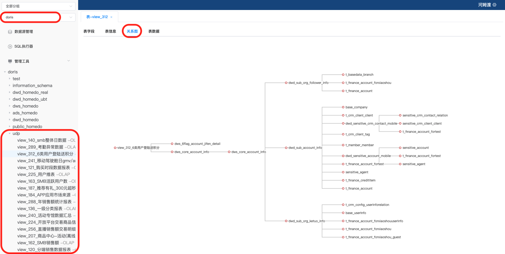
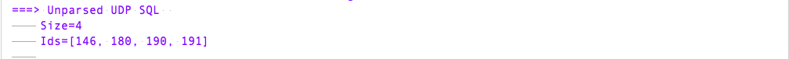

# Iris 血缘使用

## 一、使用

血缘可视化结合了开源工具 zyplayer, 当前登录地址: http://one.homedo.com/ (http://onedata.homedo.com/) 小伙伴们可以使用各自的域账号进行登录。

1. 登录界面 (有登录权限)

   


2. 选择[数据库文档]

   

3. 选择库表, 展示血缘

   

## 二、血缘元数据设计介绍

血缘中主要涉及到三种数据结构: StructDB, StructTable, WarehouseLayer 分别对应于 库, 表, 逻辑分层的概念.

元数据库 tbls 和 dbs 的设计:

```sql
CREATE TABLE IF NOT EXISTS `tbls` (
	`id` INT NOT NULL COMMENT 'table id',
	`name` VARCHAR(100) NOT NULL COMMENT 'table name',
	`insert_sql`TEXT COMMENT 'insert into/overwrite sql',
	`md5` VARCHAR(50) NOT NULL COMMENT 'md5 of sql',
	`layer`VARCHAR(50) NOT NULL COMMENT 'table layer of warehouse',
	`desc` VARCHAR(100) COMMENT 'table describe',
	`db_id` INT NOT NULL COMMENT 'database id',
	`first_schedule_time` VARCHAR(20) NOT NULL COMMENT 'first schedule time in azkaban, yyyy-MM-dd HH:mm:ss',
	`last_schedule_time` VARCHAR(20) NOT NULL COMMENT 'last schedule time in azkaban, yyyy-MM-dd HH:mm:ss',
	PRIMARY KEY (`id`)
) ENGINE=InnoDB;

CREATE TABLE IF NOT EXISTS `dbs` (
	`id` INT NOT NULL COMMENT 'database id',
	`name` VARCHAR(100) NOT NULL COMMENT 'database name',
	`type` VARCHAR(20) NOT NULL COMMENT 'database types like Doris/Hive/Mysql,......',
	`url`VARCHAR(200) NOT NULL COMMENT 'database url',
	`desc` VARCHAR(100) COMMENT 'database describe',
	PRIMARY KEY (`id`)
) ENGINE=InnoDB;

CREATE TABLE IF NOT EXISTS `across_tbs` (
	`dest_id` INT NOT NULL COMMENT 'target table id, like Doris',
	`src_id` INT NOT NULL COMMENT 'source table id, like Hive',
	PRIMARY KEY (`dest_id`)
) ENGINE=InnoDB;
```

## 三、元数据库的应用

### 3.1 跨层引用率

最近有统计数仓跨层引用表的需求, 和权彪大佬讨论后, 这个需求可以直接从元数据中对 insert_sql 进行分析, 对层名 ODS/DWD/DWS/ADS 分别赋值 1, 2, 3, 4 当上下游表的层名差值 > 1 即目标表出现跨层引用

### 3.2 Azkaban 库表的调度率

目前数仓中每天在 Azkaban 中调度的表的一个数量和频率无法完全统计, 使用 tbls 和 dbs 库可以分析每个库下有多少张表目前在 Azkaban 中调度执行, 那么剩下的表可以对其是否冗余是否需要消除进行分析.

## 四、遗留问题

1. 数仓 sql 缺失

   因为数仓 Hive 的 sql catch 基于了 HiveHook 技术, 并于 7/21号部署上线, 所以在 7/21 号之前的并且以后可能都不在运行的 sql 会无法抓取。如果需要这部分表的血缘, 需要在生产执行该表的 insert 逻辑语句。

   例如: lufax 库下 dim_fund 这张表在 7/21 之后一直不曾调度执行, 那么该表的血缘是无法被解析的, 如果现在又需要要分析该表, 建议可以在生产环境执行 `insert into lufax.dim_fund select ......` 或者可以选择在调度平台 Azkaban 上加 project

2. udp 中有 4 条 SQL 无法解析

   截止当前, udp 中的 Doris 的 view SQL 共总计 145 条. (`select count(*) from view where source_id=29;`)

   其中有 4 条, Druid 无法解析, 对应的 id 分别是: 146, 180, 190, 191

   

   截止当前, 除去无法解析的 4 条 sql, 血缘元数据库 tbls 中 udp 的 sql 总计 141 条. (`select count(*) from tbls where layer='VIEW';`) 无缺失遗漏

## 五、血缘问题自排查

当使用出现血缘无法显示的时候, 建议登录 10.0.15.181:3306/iris 数据库 tbls 表下, 查询是否存在该 name 的数据, 如果不存在, 轻参考 4.1, 如果还缺失血缘, 把相关信息登录在下面页面, 开发会尽快排查。

https://conf.homedo.com/pages/viewpage.action?pageId=240451773

