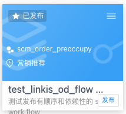
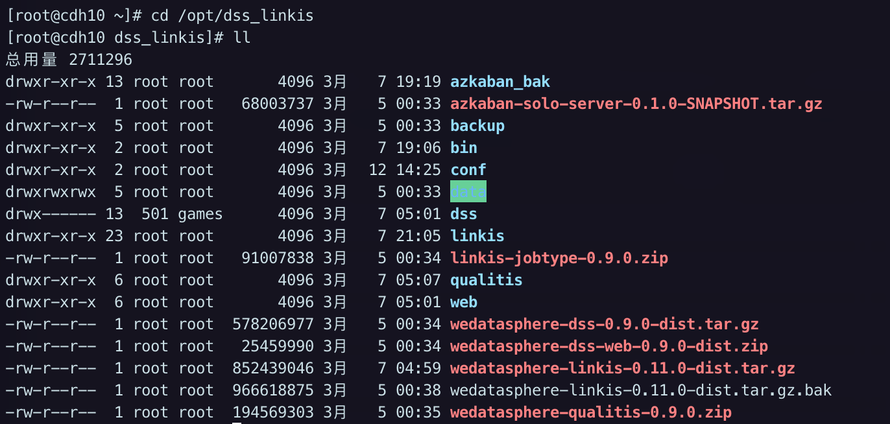
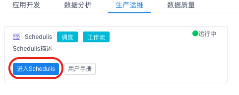
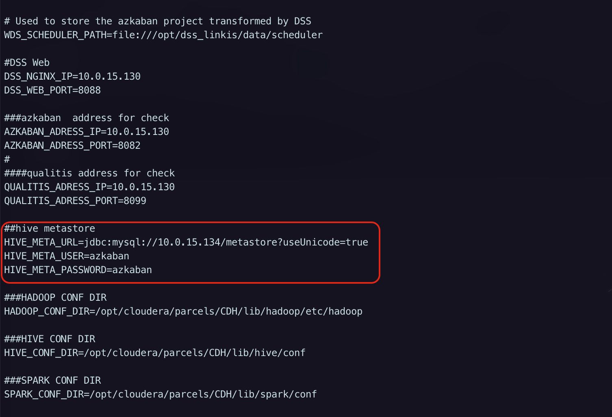
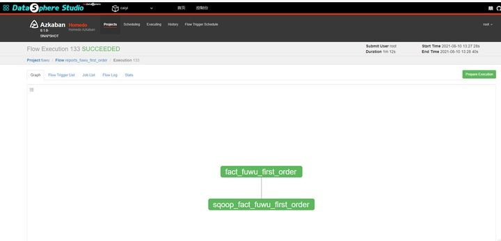
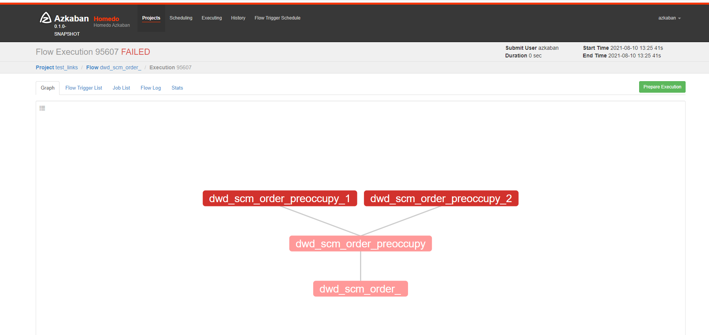

# DataOps Linkis 需求方案调研

## 一、需求

因为数据中台的整体化方案需求, 对应需要有公司自己的 DataOps 平台, 因为开发节奏的紧凑, 决定使用微众开源的 DataOps 开源平台。

组内需求:

1. 从开发环境到生产发布一键化
2. 生产发布后执行权限的隔离

## 二、调研

### 2.1 从开发环境到生产发布一键化

需求 1 的步骤拆解整个开发流程基本如下:

- 步骤①: 开发环境开发 sql
- 步骤②: 执行 sql
- 步骤③: 查看 sql 执行结果
- 步骤④: 开发环境发布到调度系统
- 步骤⑤: 从开发环境直接发布到生产环境调度系统

目前 步骤①~④, linkis 天然支持, 对于步骤⑤的调研:

#### 2.1.1 方案一

在每个 project 下添加[发布生产]按钮, 点击后发布 project 到生产 azkaban



经过查看官方文档和测试, 该方案不可行, 原因如下:

1. 如果要在一套代码中区分出两套 Azkaban 环境, 整个配置和多处调用链都需要修改, 因为项目代码量巨大, 目前整个服务链路的调用没有完全整理清楚, 短期内二次开发基本不可行

   

   

2. Linkis 代码外部数据源的配置不支持在一套环境中切换, 它将数据源配置死在一套代码中, 这样的话无法在实际环境中将开发和生产区分开, 无法做到自动环境识别

   

   

#### 2.1.2 方案二

暂不考虑切换环境, linkis 配置使用生产环境的 Azkaban.

该方案可行, Linkis 为了解耦调度工具, 用了一套自己的数据格式, 当接入 Azkaban 调度时, 它会将数据格式进行转换。 

- 测试场景 1: 下载生产环境中已经运行的 project 的 zip 包, 然后上传到 linkis 服务的 azkaban, 改该 project 依旧可运行




- 测试场景 2: 通过 Linkis 开发的 project 的 zip 包上传到生产的 Azkaban, 该 project 无法运行。

  

  > 初步分析: 通过 Linkis 提交的 project 其实质上并不存在 project flow file, Linkis 在发布工程的时候将每个作业的元数据直接写入 Azkaban 的元数据库, 而通过本地手动上传 zip 包的方式创建的 project 的方式需要分两种情况:
  >
  > - zip 包中文件为原生 Azkaban 支持的文件格式, 该 zip 上传到 linkis Azkaban 可直接运行
  > - zip 包是从 linkis azkaban 上下载的 zip, 该 zip 内元数据格式为 linkis 自定义的元数据格式, 需要 linkis 的 azkaban 插件转换后运行

### 2.2 生产发布后执行权限的隔离

关于权限隔离这一块, Linkis-0.x 原生的支持做的比较差, 在 Linkis 中如果要创建一个非 root 的普通用户, 需要如下步骤:

>1. 在所有 Linkis & DSS 服务器上创建对应 Linux 用户。
>
>   ```shell
>   [root@cdh10 home]# adduser caiyi
>   [root@cdh10 home]# ll
>   总用量 12
>   drwx------ 2 caiyi caiyi 4096 8月   9 14:28 caiyi
>   drwxr-xr-x 6 root  root  4096 5月  18 19:31 cy
>   drwx------ 2 hmd   hmd   4096 8月   2 20:12 hmd
>   ```
>
>2. 在 Hadoop 的 NameNode 创建对应 Linux 用户
>
>3. 保证Linkis & DSS 服务器上的Linux用户，可正常使用hdfs dfs -ls /等命令，同时该用户需要能正常使用Spark和hive任务， 如：通过spark-sql命令可以启动一个spark application，通过hive命令可以启动一个hive客户端
>
>4. 由于每个用户的工作空间严格隔离，您还需为该用户创建工作空间和HDFS目录，如下：
>
>   ```shell
>    # 创建用户工作空间目录
>    mkdir $WORKSPACE_USER_ROOT_PATH/${NEW_USER}
>    chmod 750 $WORKSPACE_USER_ROOT_PATH/${NEW_USER}
>   
>   # 创建用户HDFS目录
>   hdfs dfs -mkdir $HDFS_USER_ROOT_PATH/${NEW_USER}
>   hdfs dfs -chown ${NEW_USER}:${NEW_USER} $HDFS_USER_ROOT_PATH/${NEW_USER}
>   hdfs dfs -chmod 750 $HDFS_USER_ROOT_PATH/${NEW_USER}
>   ```
>
>5. WORKSPACE_USER_ROOT_PATH 和 HDFS_USER_ROOT_PATH是您一键安装DSS时，设置的工作空间和HDFS根路径。如果您没有设置，则默认为：
>
>   ```shell
>   WORKSPACE_USER_ROOT_PATH=file:///tmp/linkis
>   HDFS_USER_ROOT_PATH=hdfs:///tmp/linkis
>   ```

关于这一块, 暂时考虑在 Azkaban 和 Hive 两处做权限隔离。用域账号作为开发人员的统一账户。开发人员发布工程成功后, 程序自动钉钉或邮件通知审核人员, 审核人员上线审核后执行 azkaban 任务的调度执行。 

这里需要更改部分源码, 增加通知功能, 以及做 Azkaban 的权限隔离。

#### 2.2.1 dss 中配置 Azkaban 用户及用户的 Azkaban 权限

在 dss-server 的 token.properties 添加用户

```shell
sudo vi dss/dss-server/conf/token.properties
hadoop=hadoop
```

在 azkaban 的 azkaban-users.xml 里面添加用户

```
sudo vi azkaban/conf/token.xml
<user username="hadoop" password="hadoop" />
```

Azkaban 更多用户配置，参考[官网](https://azkaban.readthedocs.io/en/latest/userManager.html#xmlusermanager)

#### 2.2.2 hive 用户的权限控制

该部分需求现方案可以通过 HiveHook 抓取用户, 进行权限及其执行操作判断, 实施拦截或放行

## 三、最后

因为 Linkis-0.x 系列代码整体架构混乱, 微服务模块多达 14 个, 二开成本巨大, bug 较多, 官方建议生产部署使用 Linkis-1.x 版本(该版本重构后整体微服务模块为 3 个, 并且修复多个 bug), 并且本周五, Linkis-1.x 对应的可视化组件 DSS-1.0.0 发布, 个人建议生产部署 DSS-1.0 + Linkis-1.0.1 后可以对大部分功能(权限, 接入自带Azkaban, ......)做测试


