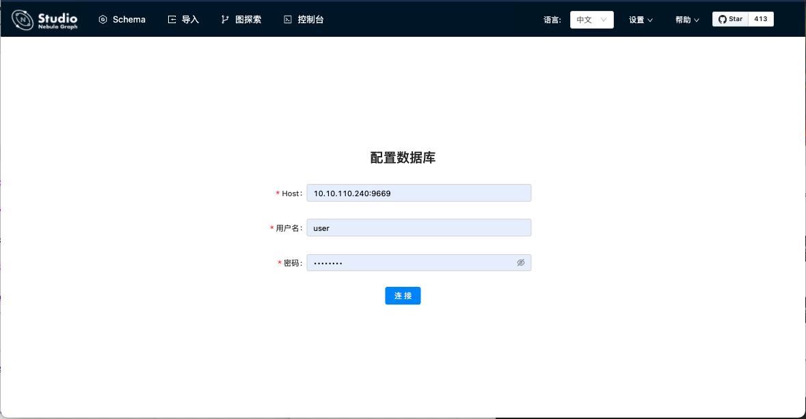
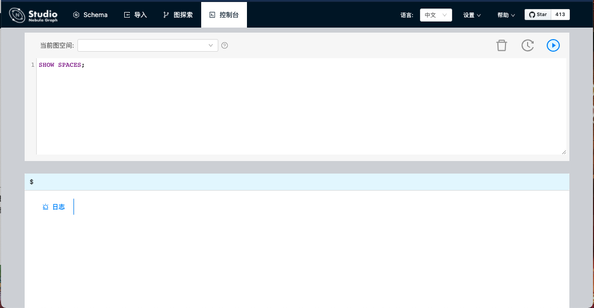
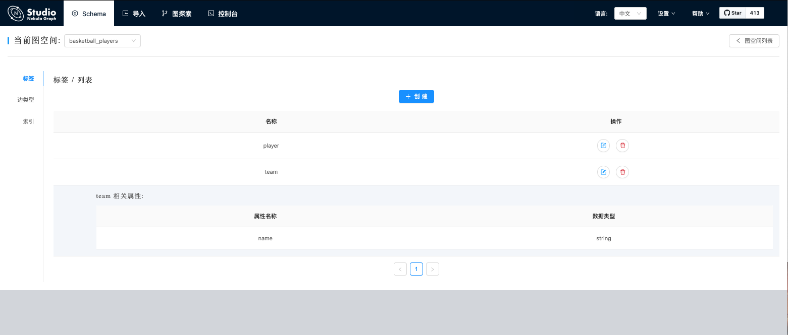
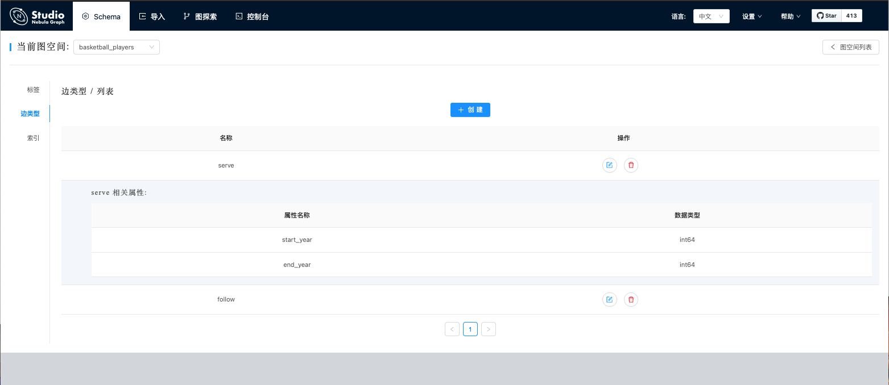
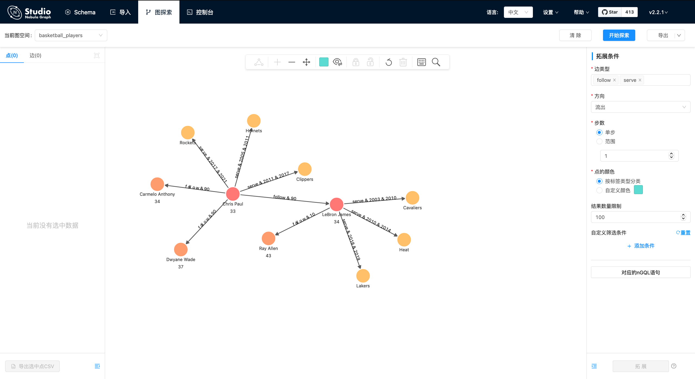

# Nebula Graph 安装

## 一、准备

环境: 

1. centOS 7.9(10.10.110.241)

   ```shell
   [hmd@bgnode1 installation]$ cat /etc/redhat-release
   CentOS Linux release 7.9.2009 (Core)
   ```

2. Nebula Graph v2.0.1

   下载地址:

   ```shell
   [hmd@bgnode1 installation]$ wget https://oss-cdn.nebula-graph.com.cn/package/2.0.1/nebula-graph-2.0.1.el7.x86_64.rpm
   ```

## 二、安装 Nebula

```shell
# 这里使用 root 用户
[root@fatcdh6 caiyi]# rpm -ivh --prefix=/opt/nebula /home/hmd/caiyi/nebula/installation/nebula-graph-2.0.1.el7.x86_64.rpm
```

因为是测试环境使用加之数据量不大, 所以使用的是单节点安装(metad|graphd|storaged 三种服务都在一个节点上)

## 三、启动

启动各个服务器上的对应服务。启动Nebula Graph服务的命令如下：`sudo ${NEBULA_HOME}/scripts/nebula.service start <metad|graphd|storaged|all>`

### 3.1 启动集群

```shell
# 这里使用 root 用户
[root@bgnode1 installation]# cd /opt/nebula
[root@bgnode1 nebula]# scripts/nebula.service start all
[WARN] The maximum files allowed to open might be too few: 1024
[INFO] Starting nebula-metad...
[INFO] Done
[INFO] Starting nebula-graphd...
[INFO] Done
[INFO] Starting nebula-storaged...
[INFO] Done
```

## 四、安装 Studio

### 4.1 前置条件

在部署 RPM 版 Studio 之前，用户需要确认以下信息：

- Nebula Graph 服务已经部署并启动。详细信息，参考 [Nebula Graph 安装部署](https://docs.nebula-graph.com.cn/2.0.1/4.deployment-and-installation/1.resource-preparations/)。

  用户可以使用 Docker Compose 或 RPM 方式部署并启动 Nebula Graph 服务。如果刚开始使用 Nebula Graph，建议使用 Docker Compose 部署 Nebula Graph。详细信息参考 [使用 Docker Compose 部署 Nebula Graph](https://docs.nebula-graph.com.cn/2.0.1/2.quick-start/2.deploy-nebula-graph-with-docker-compose/)。

- 使用的 Linux 发行版为 CentOS ，安装有 losf 和版本为 v10.16.0+ 以上的 Node.js。

  `node` 及 `npm` 命令需要安装在 `/usr/bin/`目录下，以防出现 RPM 安装时 node 命令找不到的情况。 如果依赖安装于用户个人目录下，如 `/usr/local`，用户可以使用以下命令建立软连接：

  ```shell
  $ sudo ln -s /usr/local/bin/node /usr/bin/node
  $ sudo ln -s /usr/local/bin/npm /usr/bin/npm
  ```

  - CentOS7 安装 losf

    ```sh
    [root@fatcdh6 nebula]# yum install lsof
    ```

  - CentOS7 安装 node.js

    ```shell
    # 1. 安装 gcc
    [root@fatcdh6 nebula]# yum install gcc gcc-c++
    
    # 2. 从官网下下载最新的nodejs，https://nodejs.org/en/download/
    [hmd@bgnode1 node]$ wget https://nodejs.org/dist/v14.17.1/node-v14.17.1-linux-x64.tar.xz
    # 使用 root 用户
    [root@bgnode1 node]# tar -xvf node-v14.17.1-linux-x64.tar.xz -C /usr/local/
    [root@bgnode1 node]# cd /usr/local/
    [root@bgnode1 local]# mv node-v14.17.1-linux-x64/ nodejs
    
    # 3. 使用软连接将 nodejs/bin 下的 node, npm 挂载到 /usr/bin/ 目录下
    [root@bgnode1 local]# cd /usr/bin/
    [root@bgnode1 bin]# ln -s /usr/local/nodejs/bin/npm npm
    [root@bgnode1 bin]# ln -s /usr/local/nodejs/bin/node node
    ```
    
    

- 确保在安装开始前，以下端口处于未被使用状态。

  | 端口号 | 说明                                         |
  | :----- | :------------------------------------------- |
  | 7001   | Studio提供web服务使用。                      |
  | 8080   | Nebula HTTP Gateway Client进行HTTP通信使用。 |
  | 5699   | Nebula Importer导入数据导入使用。            |

  检查端口:

  ```shell
  [root@fatcdh6 caiyi]# lsof -i:7001
  [root@fatcdh6 caiyi]# lsof -i:8080
  [root@fatcdh6 caiyi]# lsof -i:5699
  ```

### 4.2 安装

1. 根据需要选择并下载RPM包，建议选择最新版本。常用下载链接如下：

| 安装包                                                       | 检验和                                                       | Nebula版本 |
| :----------------------------------------------------------- | :----------------------------------------------------------- | :--------- |
| [nebula-graph-studio-2.2.1-1.x86_64.rpm](https://oss-cdn.nebula-graph.com.cn/nebula-graph-studio/nebula-graph-studio-2.2.1-1.x86_64.rpm) | [nebula-graph-studio-2.2.1-1.x86_64.rpm.sha256](https://oss-cdn.nebula-graph.com.cn/nebula-graph-studio/nebula-graph-studio-2.2.1-1.x86_64.rpm.sha256) | 2.0.1      |
| [nebula-graph-studio-2.2.0-1.x86_64.rpm](https://oss-cdn.nebula-graph.com.cn/nebula-graph-studio/nebula-graph-studio-2.2.0-1.x86_64.rpm) | [nebula-graph-studio-2.2.0-1.x86_64.rpm.sha256](https://oss-cdn.nebula-graph.com.cn/nebula-graph-studio/nebula-graph-studio-2.2.0-1.x86_64.rpm.sha256) | 2.0.1      |
| [nebula-graph-studio-2.1.9-1.x86_64.rpm](https://oss-cdn.nebula-graph.com.cn/nebula-graph-studio/nebula-graph-studio-2.1.9-1.x86_64.rpm) | -                                                            | 2.0 GA     |
| [nebula-graph-studio-1.2.7-2.x86_64.rpm](https://oss-cdn.nebula-graph.com.cn/nebula-graph-studio/nebula-graph-studio-1.2.7-2.x86_64.rpm) | [nebula-graph-studio-1.2.7-2.x86_64.rpm.sha256](https://oss-cdn.nebula-graph.com.cn/nebula-graph-studio/nebula-graph-studio-1.2.7-2.x86_64.rpm.sha256) | 1.x        |

2. 使用`sudo rpm -i <rpm>`命令安装RPM包。

   ```shell
   # 使用 root 用户
   [root@bgnode1 nebula]# rpm -i nebula-graph-studio-2.2.1-1.x86_64.rpm
   ......
   [egg-scripts] Save log file to /root/logs
   [egg-scripts] Wait Start: 1...
   [egg-scripts] Wait Start: 2...
   [egg-scripts] Wait Start: 3...
   [egg-scripts] egg started on http://0.0.0.0:7001
   [root@bgnode1 nebula]# nohup: 把输出追加到"nohup.out"
   2021/06/23 14:10:21 --- START OF NEBULA IMPORTER ---
   2021/06/23 14:10:21 [INFO] httpserver.go:80: Starting http server on 5699
   ```

3. 卸载

   用户可以使用以下的命令卸载 Studio。

   ```shell
   $ sudo rpm -e nebula-graph-studio-2.2.0-1.x86_64.rpm
   ```

4. 登录

   http://10.10.110.241:7001/connect-server

### 4.3 异常处理

1. 如果在安装过程中自动启动失败或是需要手动启动或停止服务，请使用以下命令

   - 手动启动服务

     ```shell
     $ bash /usr/local/nebula-graph-studio/scripts/start.sh
     ```

   - 手动停止服务

     ```shell
     $ bash /usr/local/nebula-graph-studio/scripts/stop.sh
     ```

     

2. 如果启动服务时遇到报错报错 ERROR: bind EADDRINUSE 0.0.0.0:7001，用户可以通过以下命令查看端口7001是否被占用。

   ```shell
   $ losf -i:7001
   ```

3. 如果端口被占用，且无法结束该端口上进程，用户可以通过以下命令修改 Studio 服务启动端口，并重新启动服务。

   ```shell
   //修改studio服务启动端口
    $ vi config/config.default.js
   
    //修改
    ...
        config.cluster = {
            listen: {
                port: 7001, // 修改这个端口号，改成任意一个当前可用的即可
                hostname: '0.0.0.0',
            },
        };
    ...
   
    //重新启动npm
    $ npm run start
   ```

## 五、连接 Nebula 数据库

按以下步骤连接 Nebula Graph 数据库：

1. 在 Studio 的 **配置数据库** 页面上，输入以下信息：

   - **Host**：填写 Nebula Graph 的 Graph 服务本机 IP 地址及端口。格式为 `ip:port`。如果端口未修改，则使用默认端口 `9669`。

     即使 Nebula Graph 数据库与 Studio 部署在同一台机器上，用户也必须在 **Host** 字段填写这台机器的本机 IP 地址，而不是 `127.0.0.1` 或者 `localhost`。

   - 用户名和密码：根据 Nebula Graph 的身份验证设置填写登录账号和密码。

     - 如果未启用身份验证，可以填写默认用户名 `user` 和默认密码 `password`。
     - 如果已启用身份验证，但是未创建账号信息，用户只能以 GOD 角色登录，必须填写 `root` 及对应的密码 `nebula`。
     - 如果已启用身份验证，同时又创建了不同的用户并分配了角色，不同角色的用户使用自己的账号和密码登录。

     

2. 完成设置后，点击 **连接** 按钮。
   如果能看到如下图所示的界面，表示已经成功连接到 Nebula Graph 数据库。

   

   一次连接会话持续 30 分钟。如果超过 30 分钟没有操作，会话即断开，用户需要重新登录数据库。

   

3. 后续操作

   成功连接 Nebula Graph 数据库后，根据账号的权限，用户可以选择执行以下操作：

   - 如果已拥有 GOD 或者 ADMIN 权限的账号登录，可以使用 [**控制台**](https://docs.nebula-graph.com.cn/2.0.1/nebula-studio/quick-start/st-ug-create-schema/) 或者 [**Schema**](https://docs.nebula-graph.com.cn/2.0.1/nebula-studio/manage-schema/st-ug-crud-space/) 页面管理 Schema。
   - 如果已拥有 GOD、ADMIN、DBA 或者 USER 权限的账号登录，可以 [批量导入数据](https://docs.nebula-graph.com.cn/2.0.1/nebula-studio/quick-start/st-ug-import-data/) 或者在 **控制台** 页面上运行 nGQL 语句插入数据。
   - 如果已拥有 GOD、ADMIN、DBA、USER 或者 GUEST 权限的账号登录，可以在 **控制台** 页面上运行 nGQL 语句读取数据或者在 **图探索** 页面上进行图探索或数据分析。

## 六、导入数据

准备好 CSV 文件，创建了 Schema 后，用户可以使用 **导入** 功能将所有点和边数据上传到 Studio，用于数据查询、图探索和数据分析。

### 6.1 前提条件

导入数据之前，需要确认以下信息：

- Studio 已经连接到 Nebula Graph 数据库。

- Nebula Graph 数据库里已经创建了 Schema。

- CSV 文件符合 Schema 要求。

- 账号拥有 GOD、ADMIN、DBA 或者 USER 的权限，能往图空间中写入数据。

#### 6.1.1 Schema 的创建

在使用 Studio 之前，用户需要先根据 Nebula Graph 数据库的要求规划 Schema（模式）。

Schema 至少要包含以下要素：

- 标签（Tag，即点类型），以及每种标签的属性。

- 边类型（Edge Type），以及每种边类型的属性。

用户可以下载Nebula Graph示例数据集[basketballplayer](https://docs-cdn.nebula-graph.com.cn/dataset/dataset.zip) ，本文将通过该实例说明如何规划 Schema。

下表列出了 Schema 要素。

| 类型   | 名称       | 属性名（数据类型）                              | 说明                                                         |
| ------ | ---------- | ----------------------------------------------- | ------------------------------------------------------------ |
| 标签   | **player** | - `name` （`string`） - `age` （`int`）         | 表示球员。                                                   |
| 标签   | **team**   | - `name` （`string`）                           | 表示球队。                                                   |
| 边类型 | **serve**  | - `start_year` （`int`） - `end_year` （`int`） | 表示球员的行为。 该行为将球员和球队联系起来，方向是从球员到球队。 |
| 边类型 | **follow** | - `degree`（`int`）                             | 表示球员的行为。 该行为将两个球员联系起来，方向是从一个球员到另一个球员。 |

下图说明示例中 **player** 类点与 **team** 类点之间如何发生关系（**serve**/**follow**）。

)

下图分别是 tag 和 edge 的创建(推荐使用 nGql 语句)

```sql
-- 创建标签 player，带有 2 个属性
CREATE TAG player(name string, age int);

-- 创建标签 team，带有 1 个属性
CREATE TAG team(name string);

-- 创建边类型 follow，带有 1 个属性
CREATE EDGE follow(degree int);

-- 创建边类型 serve，带有 2 个属性
CREATE EDGE serve(start_year int, end_year int);
```







### 6.2 操作步骤

按以下步骤导入数据：

1. 在工具栏里，点击 **导入** 页签。

2. 在 **选择Space** 页面，选择一个图空间，再点击 **下一步** 按钮。

   

3. 在 **上传文件** 页面，点击 **上传文件** 按钮，并选择需要的 CSV 文件。本示例中，选择 `edge_serve.csv`、`edge_follow.csv`、`vertex_player.csv` 和 `vertex_team.csv` 文件。

   Note

   一次可以选择多个 CSV 文件，本文使用的 CSV 文件可以在[规划 Schema ](https://docs.nebula-graph.com.cn/2.0.1/nebula-studio/quick-start/st-ug-plan-schema/)中下载。

4. 在文件列表的 **操作** 列，点击 **预览** 或 **删除**，保证文件信息正确，之后，再点击 **下一步** 按钮。

5. 在 **关联点** 页面，点击 **+ 绑定数据源** 按钮，在对话框中选择点数据文件，并点击 **确认** 按钮。如本示例中的 `vertex_player.csv` 或 `vertex_team.csv` 文件。

6. 在 **数据源 X** 页签下，点击 **+ Tag** 按钮。

7. 在 **vertexId** 部分，完成以下操作：

### 6.3 导入数据后进行查询

输入 vid: [player121, player116]




## 七、nGql 语法

### 7.1 SPACE

图空间是 Nebula Graph 中彼此隔离的图数据集合，与 MySQL 中的 database 概念类似。

#### 7.1.1 CREATE SPACE

`CREATE SPACE `语句可以通过指定名称创建一个新的图空间。

```sql
CREATE SPACE [IF NOT EXISTS] <graph_space_name> [(
  partition_num = <partition_number>, 
  replica_factor = <replica_number>,
  charset = utf8, 
  collate = utf8_bin,
  vid_type = {FIXED_STRING(<N>) | INT64}
)];
```

#### 7.1.2 USE SPACE

`USE`语句可以指定一个图空间，或切换到另一个图空间，将其作为后续查询的工作空间。

```sql
USE <graph_space_name>;
```

#### 7.1.3 SHOW SPACES

`SHOW SPACES`语句可以列出Nebula Graph示例中的所有图空间。

```SQL
nebula> SHOW SPACES;
+--------------------+
| Name               |
+--------------------+
| "cba"              |
+--------------------+
| "basketballplayer" |
+--------------------+
```

#### 7.1.4 DESCRIBE SPACE

`DESCRIBE SPACE`语句可以显示指定图空间的信息。

```sql
DESC[RIBE] SPACE <graph_space_name>;
```

#### 7.1.5 DROP SPACE

`DROP SPACE`语句可以删除指定图空间的所有内容。

```sql
DROP SPACE [IF EXISTS] <graph_space_name>;
```

### 7.2 TAG

nGQL中的tag和openCypher中的label相似，但又有所不同，例如它们的创建方式。

- openCypher中的label需要在`CREATE`语句中与点一起创建。
- nGQL中的tag需要使用`CREATE TAG`语句独立创建。tag更像是MySQL中的表。

> tips: 执行`CREATE TAG`语句需要当前登录的用户拥有指定图空间的[创建标签权限](https://docs.nebula-graph.com.cn/2.0/7.data-security/1.authentication/3.role-list/)，否则会报错。

#### 7.2.1 CREATE TAG

`CREATE TAG`语句可以通过指定名称创建一个标签。

```sql
CREATE TAG [IF NOT EXISTS] <tag_name>
    ([<create_definition>, ...])
    [tag_options];

<create_definition> ::=
    <prop_name> <data_type> [NULL | NOT NULL]

<tag_options> ::=
    <option> [, <option> ...]

<option> ::=
    TTL_DURATION [=] <ttl_duration>
    | TTL_COL [=] <prop_name>
    | DEFAULT <default_value>
```

eg:

```sql
-- 创建标签 player，带有 2 个属性
CREATE TAG player(name string, age int);

-- 创建标签 team，带有 1 个属性
CREATE TAG team(name string);

-- 创建边类型 follow，带有 1 个属性
CREATE EDGE follow(degree int);

-- 创建边类型 serve，带有 2 个属性
CREATE EDGE serve(start_year int, end_year int);
```

#### 7.2.2 DROP TAG

`DROP TAG`语句可以删除当前工作空间内的指定标签。

```
DROP TAG [IF EXISTS] <tag_name>;
```

## 八、踩坑

1. 使用图形界面创建 SPACE 的时, 有一项 vid_type， 如果 CREATE SPACE 时没有指定 vid_type，那么默认是 FIXED_STRING(8)。 所以当你的vid值超过 8 个字符时 数据会插入失败。 

   > 创建 SPACE 的时候, 把 vid_type 放大 (建议使用 nGql 语句来创建 SPACE)
   >
   > ```SQL
   > CREATE SPACE [IF NOT EXISTS] <graph_space_name>[(
   >   partition_num = <partition_number>, 
   > 	replica_factor = <replica_number>, 
   > 	vid_type = {FIXED_STRING(<N>) | INT64}
   > )];
   > ```
   >
   > eg:
   >
   > ```sql
   > CREATE SPACE IF NOT EXISTS basketball_players (
   >   partition_num = 1, 
   >   replica_factor = 1, 
   >   charset = utf8, 
   >   collate = utf8_bin, 
   >   vid_type = FIXED_STRING(20)
   > );
   > ```

   

